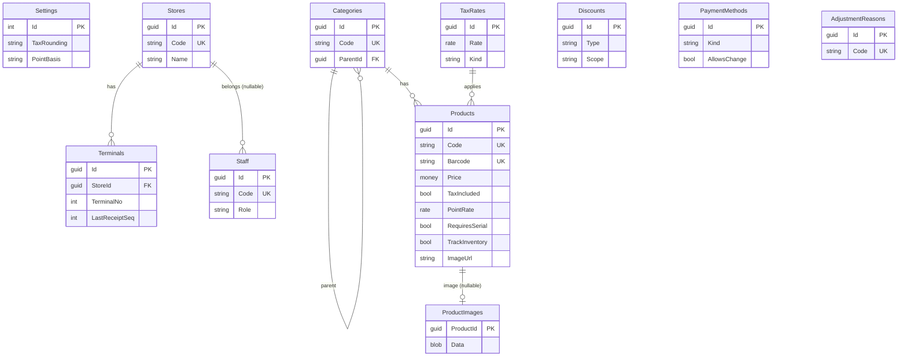
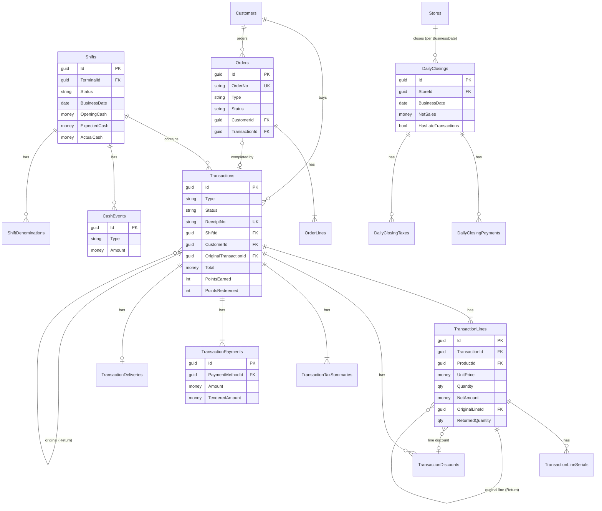
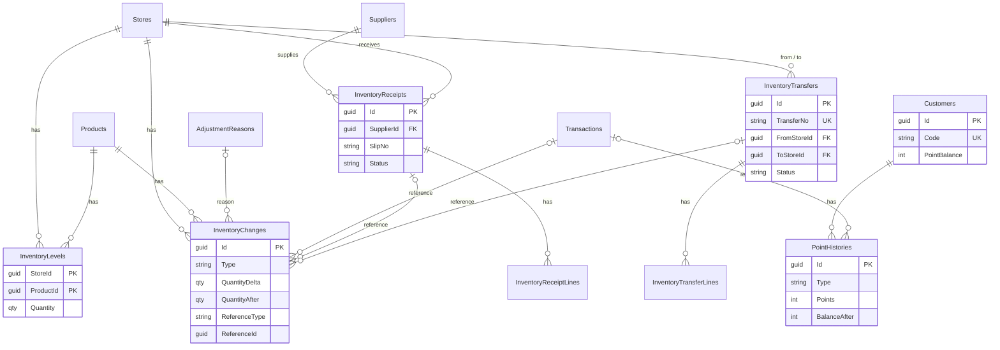

# POS サーバ DB 設計

[api-design.md](api-design.md) に対応するサーバ側データベース (SQLite) の設計。  
設計判断は [decisions.md](decisions.md)、プロジェクト構成は [architecture.md](architecture.md)。

- [1. 前提](#1-前提)
- [2. ER 図](#2-er-図)
- [3. テーブル定義](#3-テーブル定義)
- [4. DDL 例](#4-ddl-例)
- [5. 整合性と更新の単位](#5-整合性と更新の単位)
- [6. 端末ローカル DB (SQLite) の概要](#6-端末ローカル-db-sqlite-の概要)

---

## 1. 前提

| 項目 | 内容 |
| --- | --- |
| RDBMS | **SQLite** (`Microsoft.Data.Sqlite`)。接続文字列は `Data Source=pos.db;Cache=Shared;Pooling=True`。WAL と `busy_timeout` を起動時の PRAGMA で設定する |
| データアクセス | `Usa.Smart.Data.Accessor` の `[DataAccessor]` + 2-way SQL ファイル (`Accessors/Sql/{Accessor}.{Method}.sql`)。ORM は使わない。SQL は Accessor だけが持ち、Accessor を使うのは `Services/` の Service だけ ([D-45](decisions.md#d-45-サーバの-service-層)) |
| スキーマ作成 | 起動時に `Host/Assets/Data/Schema.sql` (`CREATE TABLE IF NOT EXISTS` + `CREATE INDEX IF NOT EXISTS`) を読んで実行する。後から増えた列は `SchemaHelper.EnsureColumnAsync` (`PRAGMA table_info` で確認して `ALTER TABLE ADD COLUMN`) で既存の DB に足す |
| 命名 | テーブル = 複数形 PascalCase (`Transactions`)、列 = PascalCase。FK は `〜Id`。エンティティクラスは `{Table 単数}Entity` (`TransactionEntity`) |
| 主キー | `guid` を **TEXT (36 文字。`Microsoft.Data.Sqlite` の既定で大文字)** で保存。端末発のデータは端末が GUID v7 を採番 ([D-10](decisions.md#d-10-冪等性-クライアント採番-id)) |
| 列挙型 | TEXT (列挙名)。汎用 `EnumTextConverter<T>` を `DataProfile` (`[AccessorProfile]`) に列挙型ごとに宣言し、各 Accessor が `[ExecuteConfig(typeof(DataProfile))]` で参照する ([D-25](decisions.md#d-25-日時と列挙型の-sqlite-保存形式))。値は API の enum と同じ |
| 論理削除 | マスタ系は `IsDeleted`。差分同期で削除も伝える必要があるので、通常の照会側で `IsDeleted = 0` を明示する |
| 監査列 | `CreatedAt` / `UpdatedAt` (UTC)。マスタ系は楽観ロック用 `Version` (INTEGER、更新ごとに +1) |
| 履歴 | 取引・シフト・入出金・在庫変動・ポイント履歴は**更新・削除しない** (取消も `Status` 更新 + 逆方向の履歴追加)。日次締めは締め解除で行ごと消し、締め直しで作り直す |
| スナップショット | 取引明細は商品名・単価・税率・還元率を販売時点の値で保持する。マスタ変更が過去の取引に影響しない |
| 外部キー | `FOREIGN KEY` は宣言するが、SQLite の既定では強制されないため接続文字列の `Foreign Keys=True` で接続ごとに有効化する (WAL と busy_timeout は起動時の `GenericAccessor.ExecutePragmaAsync`) |

型の表記 (C# ↔ SQLite):

| 表記 | C# | SQLite | 備考 |
| --- | --- | --- | --- |
| `guid` | `Guid` | `TEXT` | `Microsoft.Data.Sqlite` の既定 (36 文字、大文字)。生成コードは `GetGuid` で読む |
| `string(n)` | `string` | `TEXT` | 長さはアプリ側で検証 (SQLite は長さ制約を強制しない) |
| `money` | `decimal` | `NUMERIC` | 円。`Microsoft.Data.Sqlite` は `decimal` を TEXT で書くが、NUMERIC 親和性により数値 (INTEGER / REAL) に変換されて保存される ([D-13](decisions.md#d-13-金額数量率の表現-decimal)) |
| `rate` | `decimal` | `NUMERIC` | `0.1` (REAL として保存)。集計しない |
| `qty` | `decimal` | `NUMERIC` | 数量 (小数可) |
| `int` | `int` | `INTEGER` | |
| `bool` | `bool` | `INTEGER` | 0 / 1 |
| `datetime` | `DateTime` (UTC) | `TEXT` | `yyyy-MM-dd HH:mm:ss.fffffff` (`Microsoft.Data.Sqlite` の既定書式。文字列比較で範囲検索できる)。`DateTimeTextConverter` で UTC に固定して読み書きする |
| `date` | `DateOnly` | `TEXT` | `yyyy-MM-dd` (`DateOnlyTextConverter`) |
| `enum` | enum | `TEXT` | 列挙名 |

---

## 2. ER 図

### 2.1 マスタ



### 2.2 取引・シフト



### 2.3 在庫・顧客



---

## 3. テーブル定義

「共通列」= `CreatedAt datetime`, `UpdatedAt datetime`。  
マスタ系はさらに `IsDeleted bool`, `Version int`。

### 3.1 マスタ

#### Settings (会社設定、1 行)

| 列 | 型 | NULL | 説明 |
| --- | --- | --- | --- |
| Id | int | | PK。常に 1 |
| CompanyName | string(100) | | |
| Currency | string(3) | | `JPY` |
| TaxRounding | enum | | `Floor` / `Round` / `Ceiling` |
| PointBasis | enum | | `TaxIncluded` / `TaxExcluded` |
| BusinessDayStartTime | string(5) | | `05:00` |
| UpdatedAt, Version | | | |

#### Stores (店舗)

| 列 | 型 | NULL | 説明 |
| --- | --- | --- | --- |
| Id | guid | | PK |
| Code | string(10) | | UQ。レシート番号の一部 |
| Name | string(100) | | |
| PostalCode | string(10) | ○ | |
| Address | string(200) | ○ | |
| Phone | string(20) | ○ | |
| RegistrationNo | string(14) | ○ | 適格請求書発行事業者登録番号 |
| ReceiptHeader | string(500) | ○ | |
| ReceiptFooter | string(500) | ○ | |
| TimeZone | string(50) | | `Asia/Tokyo` |
| IsActive | bool | | |
| 共通列 + IsDeleted, Version | | | |

索引: `UQ(Code)`, `IX(UpdatedAt)`

#### Terminals (レジ端末)

| 列 | 型 | NULL | 説明 |
| --- | --- | --- | --- |
| Id | guid | | PK |
| StoreId | guid | | FK → Stores |
| TerminalNo | int | | 店舗内番号 |
| Name | string(50) | | |
| LastReceiptSeq | int | | 最終レシート連番 (取引登録時に更新) |
| LastSeenAt | datetime | ○ | |
| AppVersion | string(20) | ○ | |
| IsActive | bool | | |
| 共通列 + IsDeleted, Version | | | |

索引: `UQ(StoreId, TerminalNo)`, `IX(UpdatedAt)`

#### Staff (スタッフ)

| 列 | 型 | NULL | 説明 |
| --- | --- | --- | --- |
| Id | guid | | PK |
| Code | string(20) | | UQ |
| Name | string(50) | | |
| Role | enum | | `Cashier` / `Manager` / `Admin` |
| StoreId | guid | ○ | FK → Stores。NULL = 本部 |
| PinHash | BLOB | ○ | 未使用 (スタッフ PIN のハッシュ用) |
| IsActive | bool | | |
| 共通列 + IsDeleted, Version | | | |

索引: `UQ(Code)`, `IX(StoreId)`, `IX(UpdatedAt)`

#### Categories (部門)

| 列 | 型 | NULL | 説明 |
| --- | --- | --- | --- |
| Id | guid | | PK |
| Code | string(20) | | UQ |
| Name | string(100) | | |
| ParentId | guid | ○ | FK → Categories (自己参照) |
| SortOrder | int | | |
| 共通列 + IsDeleted, Version | | | |

索引: `UQ(Code)`, `IX(ParentId)`, `IX(UpdatedAt)`

#### TaxRates (税率)

| 列 | 型 | NULL | 説明 |
| --- | --- | --- | --- |
| Id | guid | | PK |
| Code | string(10) | | UQ (`STD` / `RED` / `EXEMPT`) |
| Name | string(50) | | |
| Rate | rate | | `0.1000` |
| Kind | enum | | `Standard` / `Reduced` / `Exempt` |
| IsDefault | bool | | |
| SortOrder | int | | |
| 共通列 + IsDeleted, Version | | | |

#### Products (商品)

| 列 | 型 | NULL | 説明 |
| --- | --- | --- | --- |
| Id | guid | | PK |
| Code | string(20) | | UQ 商品コード |
| Barcode | string(20) | ○ | UQ (NULL を除く)。JAN / EAN |
| Name | string(100) | | |
| Kana | string(100) | ○ | |
| Brand | string(50) | ○ | |
| ModelNo | string(50) | ○ | |
| CategoryId | guid | | FK → Categories |
| Kind | enum | | `Goods` / `Service` |
| Price | money | | |
| TaxIncluded | bool | | |
| TaxRateId | guid | | FK → TaxRates |
| Cost | money | ○ | |
| PointRate | rate | | |
| RequiresSerial | bool | | |
| TrackInventory | bool | | |
| AllowsPriceOverride | bool | | |
| Unit | string(10) | ○ | |
| ImageUrl | string(500) | ○ | 画像の URL (`/api/v1/products/{id}/image?v={内容のハッシュ}`)。画像を変えると `UpdatedAt` / `Version` も進める |
| IsActive | bool | | |
| 共通列 + IsDeleted, Version | | | |

索引: `UQ(Code)`, `UQ(Barcode) WHERE Barcode IS NOT NULL`, `IX(CategoryId)`, `IX(Name)`, `IX(Kana)`, `IX(UpdatedAt)`

#### ProductImages (商品画像)

画像は DB に持つ ([D-65](decisions.md#d-65-商品画像-db-に持ち内容のハッシュ付きの-url-で配る))。  
形式 (JPEG / PNG) は `Data` の先頭のバイトで判定し、列には持たない。

| 列 | 型 | NULL | 説明 |
| --- | --- | --- | --- |
| ProductId | guid | | PK, FK → Products |
| Data | blob | | 画像 (2 MB まで) |
| UpdatedAt | datetime | | |

#### Discounts (値引定義)

| 列 | 型 | NULL | 説明 |
| --- | --- | --- | --- |
| Id | guid | | PK |
| Code | string(20) | | UQ |
| Name | string(50) | | |
| Type | enum | | `Amount` / `Percent` |
| Value | decimal | | 金額または率 |
| Scope | enum | | `Line` / `Transaction` |
| RequiresApproval | bool | | |
| IsActive | bool | | |
| SortOrder | int | | |
| 共通列 + IsDeleted, Version | | | |

#### PaymentMethods (支払方法)

| 列 | 型 | NULL | 説明 |
| --- | --- | --- | --- |
| Id | guid | | PK |
| Code | string(20) | | UQ |
| Name | string(50) | | |
| ShortName | string(10) | ○ | 端末の支払ボタンに出す短い名前 (省略時は Name) |
| Kind | enum | | `Cash` / `Card` / `Qr` / `EMoney` / `Voucher` / `Points` / `Credit` / `Other` |
| AllowsChange | bool | | |
| RequiresReference | bool | | |
| IsActive | bool | | |
| SortOrder | int | | |
| 共通列 + IsDeleted, Version | | | |

アプリ側制約: `Kind = Points` かつ有効な行はちょうど 1 件。

#### AdjustmentReasons (在庫調整理由)

| 列 | 型 | NULL | 説明 |
| --- | --- | --- | --- |
| Id | guid | | PK |
| Code | string(20) | | UQ |
| Name | string(50) | | |
| SortOrder | int | | |
| IsActive | bool | | |
| 共通列 + IsDeleted, Version | | | |

#### Suppliers (仕入先)

| 列 | 型 | NULL | 説明 |
| --- | --- | --- | --- |
| Id | guid | | PK |
| Code | string(20) | | UQ |
| Name | string(100) | | |
| Phone | string(20) | ○ | |
| Email | string(100) | ○ | |
| Note | string(500) | ○ | |
| IsActive | bool | | 入荷予定の登録で選べる |
| 共通列 + IsDeleted, Version | | | |

入荷は削除済みの仕入先の名前も引く。  
端末には同期しない。

### 3.2 顧客

#### Customers (顧客)

| 列 | 型 | NULL | 説明 |
| --- | --- | --- | --- |
| Id | guid | | PK |
| Code | string(20) | | UQ 会員番号 |
| Name | string(100) | | |
| Kana | string(100) | ○ | |
| Phone | string(20) | ○ | |
| Email | string(100) | ○ | |
| PostalCode | string(10) | ○ | |
| Address | string(200) | ○ | |
| BirthDate | date | ○ | |
| PointBalance | int | | 現在残高 (PointHistories の集計を非正規化) |
| Note | string(500) | ○ | |
| 共通列 + IsDeleted, Version | | | |

索引: `UQ(Code)`, `IX(Phone)`, `IX(Kana)`, `IX(UpdatedAt)`

#### PointHistories (ポイント履歴)

| 列 | 型 | NULL | 説明 |
| --- | --- | --- | --- |
| Id | guid | | PK |
| CustomerId | guid | | FK → Customers |
| Type | enum | | `Earn` / `Redeem` / `Revoke` / `Refund` / `Void` / `Adjust` |
| Points | int | | 符号付き |
| BalanceAfter | int | | |
| TransactionId | guid | ○ | FK → Transactions |
| Reason | string(200) | ○ | |
| StaffId | guid | ○ | FK → Staff |
| OccurredAt | datetime | | |
| CreatedAt | datetime | | |

索引: `IX(CustomerId, OccurredAt DESC)`, `IX(TransactionId)`

### 3.3 シフト (レジ開閉)

#### Shifts

| 列 | 型 | NULL | 説明 |
| --- | --- | --- | --- |
| Id | guid | | PK (端末採番) |
| StoreId | guid | | FK → Stores |
| TerminalId | guid | | FK → Terminals |
| Status | enum | | `Open` / `Closed` |
| BusinessDate | date | | |
| OpenedAt | datetime | | |
| OpenedByStaffId | guid | | FK → Staff |
| OpeningCash | money | | |
| ClosedAt | datetime | ○ | |
| ClosedByStaffId | guid | ○ | FK → Staff |
| ActualCash | money | ○ | |
| ExpectedCash | money | ○ | 精算時に確定 |
| Difference | money | ○ | `ActualCash − ExpectedCash` |
| CashSales | money | | 精算時に確定 (Open 中は取引から都度集計) |
| CashReturns | money | | 同上 |
| PaidIn | money | | 同上 |
| PaidOut | money | | 同上 |
| SalesCount | int | | 同上 |
| ReturnCount | int | | 同上 |
| VoidCount | int | | 同上 |
| SalesTotal | money | | 同上 |
| ReturnsTotal | money | | 同上 |
| Note | string(500) | ○ | |
| 共通列 | | | |

索引: `UQ(TerminalId) WHERE Status = 'Open'` (端末につき開設中は 1 つ。SQLite の部分インデックス)、`IX(StoreId, BusinessDate)`

#### ShiftDenominations (金種別枚数)

| 列 | 型 | NULL | 説明 |
| --- | --- | --- | --- |
| ShiftId | guid | | PK, FK → Shifts |
| Denomination | int | | PK (10000, 5000, 1000, 500, 100, 50, 10, 5, 1) |
| Count | int | | |

#### CashEvents (入出金)

| 列 | 型 | NULL | 説明 |
| --- | --- | --- | --- |
| Id | guid | | PK (端末採番) |
| ShiftId | guid | | FK → Shifts |
| Type | enum | | `PaidIn` / `PaidOut` / `NoSale` |
| Amount | money | | |
| Reason | string(100) | ○ | |
| StaffId | guid | | FK → Staff |
| OccurredAt | datetime | | |
| CreatedAt | datetime | | |

索引: `IX(ShiftId, OccurredAt)`

### 3.4 日次締め

店舗 × 営業日の締め ([D-63](decisions.md#d-63-日次締め-締めた時点の日計を持ち締め後の取消を止める))。  
締めた時点の日計と内訳を写して持ち、締め解除で内訳ごと消す。

#### DailyClosings

| 列 | 型 | NULL | 説明 |
| --- | --- | --- | --- |
| Id | guid | | PK (サーバ採番) |
| StoreId | guid | | FK → Stores |
| BusinessDate | date | | 営業日 |
| ClosedAt | datetime | | |
| ClosedBy | string | ○ | 締めた管理画面のアカウント名 (認証の導入までは NULL) |
| ShiftCount | int | | その営業日のシフトと、その営業日の取引を含むシフトの数 |
| SalesCount | int | | 以下は締めた時点の日計 (取消済みを除き、返品は負) |
| ReturnCount | int | | |
| VoidCount | int | | |
| CustomerCount | int | | 会員の人数 |
| SalesTotal | money | | |
| ReturnsTotal | money | | |
| NetSales | money | | |
| DiscountTotal | money | | |
| TaxTotal | money | | |
| PointsEarned | int | | |
| PointsRedeemed | int | | |
| HasLateTransactions | bool | | 締めた後に同じ営業日の取引が届いた (締め直すまで日計に含まれない) |
| CreatedAt / UpdatedAt | datetime | | |

索引: `UQ(StoreId, BusinessDate)`

#### DailyClosingPayments (支払方法別)

| 列 | 型 | NULL | 説明 |
| --- | --- | --- | --- |
| DailyClosingId | guid | | PK, FK → DailyClosings |
| LineNo | int | | PK (表示順) |
| PaymentMethodId | guid | | FK → PaymentMethods |
| Name | string | | 締めた時点の名称 |
| Kind | enum | | |
| SalesAmount / SalesCount | money / int | | 販売への充当額と件数 |
| ReturnAmount / ReturnCount | money / int | | 返金額と件数 |

#### DailyClosingTaxes (税率別)

| 列 | 型 | NULL | 説明 |
| --- | --- | --- | --- |
| DailyClosingId | guid | | PK, FK → DailyClosings |
| LineNo | int | | PK (表示順) |
| TaxRateId | guid | | FK → TaxRates |
| Rate | rate | | |
| TaxIncluded | bool | | |
| TaxableAmount | money | | 返品は負として合算 |
| TaxAmount | money | | 同上 |

### 3.5 取引

#### Transactions

| 列 | 型 | NULL | 説明 |
| --- | --- | --- | --- |
| Id | guid | | PK (端末採番) |
| Type | enum | | `Sale` / `Return` |
| Status | enum | | `Completed` / `Voided` |
| StoreId | guid | | FK → Stores |
| TerminalId | guid | | FK → Terminals |
| StaffId | guid | | FK → Staff |
| ShiftId | guid | | FK → Shifts |
| CustomerId | guid | ○ | FK → Customers |
| ReceiptNo | string(20) | | UQ |
| BusinessDate | date | | |
| TransactedAt | datetime | | |
| OriginalTransactionId | guid | ○ | FK → Transactions (Return の元取引) |
| Subtotal | money | | |
| DiscountTotal | money | | |
| NetSubtotal | money | | |
| TaxTotal | money | | |
| Total | money | | |
| TenderedTotal | money | | |
| ChangeAmount | money | | |
| PointsEarned | int | | Return は負 |
| PointsRedeemed | int | | Return は負 |
| PointsBalanceAfter | int | ○ | |
| Note | string(500) | ○ | |
| VoidedAt | datetime | ○ | |
| VoidedByStaffId | guid | ○ | FK → Staff |
| VoidReason | string(200) | ○ | |
| 共通列 | | | |

索引: `UQ(ReceiptNo)`, `IX(StoreId, BusinessDate)`, `IX(ShiftId)`, `IX(TerminalId, TransactedAt)`, `IX(CustomerId, TransactedAt)`, `IX(OriginalTransactionId)`, `IX(TransactedAt)`

#### TransactionLines

| 列 | 型 | NULL | 説明 |
| --- | --- | --- | --- |
| Id | guid | | PK (端末採番) |
| TransactionId | guid | | FK → Transactions |
| LineNo | int | | |
| ProductId | guid | | FK → Products |
| ProductCode | string(20) | | スナップショット |
| ProductName | string(100) | | スナップショット |
| CategoryId | guid | | FK → Categories (販売時点) |
| Kind | enum | | `Goods` / `Service` |
| ListPrice | money | | |
| UnitPrice | money | | |
| Quantity | qty | | |
| TaxRateId | guid | | FK → TaxRates |
| TaxRate | rate | | スナップショット |
| TaxIncluded | bool | | スナップショット |
| PointRate | rate | | スナップショット |
| Amount | money | | |
| DiscountAmount | money | | |
| AllocatedDiscountAmount | money | | |
| NetAmount | money | | |
| PointsRedeemed | int | | 按分 |
| PointsEarned | int | | |
| OriginalLineId | guid | ○ | FK → TransactionLines (Return の元明細) |
| ReturnedQuantity | qty | | 元明細側で更新される唯一の列 |
| Note | string(200) | ○ | |

索引: `UQ(TransactionId, LineNo)`, `IX(ProductId)`, `IX(OriginalLineId)`

#### TransactionLineSerials

| 列 | 型 | NULL | 説明 |
| --- | --- | --- | --- |
| TransactionLineId | guid | | PK, FK → TransactionLines |
| SerialNumber | string(50) | | PK |

索引: `IX(SerialNumber)` (シリアルからの取引検索用)

#### TransactionDiscounts

| 列 | 型 | NULL | 説明 |
| --- | --- | --- | --- |
| Id | guid | | PK |
| TransactionId | guid | | FK → Transactions |
| LineId | guid | ○ | FK → TransactionLines。NULL = 取引値引 |
| DiscountId | guid | ○ | FK → Discounts。NULL = 任意値引 |
| SortNo | int | | |
| Name | string(50) | | |
| Type | enum | | `Amount` / `Percent` |
| Value | decimal | | |
| Amount | money | | |
| Reason | string(200) | ○ | |
| ApprovedByStaffId | guid | ○ | FK → Staff。承認が必要な値引の承認者 |

索引: `IX(TransactionId)`

#### TransactionTaxSummaries

| 列 | 型 | NULL | 説明 |
| --- | --- | --- | --- |
| TransactionId | guid | | PK, FK → Transactions |
| TaxRateId | guid | | PK, FK → TaxRates |
| TaxIncluded | bool | | PK |
| Rate | rate | | |
| TaxableAmount | money | | |
| TaxAmount | money | | |

#### TransactionPayments

| 列 | 型 | NULL | 説明 |
| --- | --- | --- | --- |
| Id | guid | | PK |
| TransactionId | guid | | FK → Transactions |
| SeqNo | int | | |
| PaymentMethodId | guid | | FK → PaymentMethods |
| Kind | enum | | スナップショット |
| Amount | money | | |
| TenderedAmount | money | | |
| Reference | string(50) | ○ | |
| Note | string(200) | ○ | |

索引: `UQ(TransactionId, SeqNo)`, `IX(PaymentMethodId)`

#### TransactionDeliveries

| 列 | 型 | NULL | 説明 |
| --- | --- | --- | --- |
| TransactionId | guid | | PK, FK → Transactions |
| RecipientName | string(100) | | |
| Phone | string(20) | ○ | |
| PostalCode | string(10) | ○ | |
| Address | string(200) | | |
| RequestedDate | date | ○ | |
| TimeSlot | string(20) | ○ | |
| Note | string(200) | ○ | |

### 3.6 受注

取り寄せ・取り置きの約束 ([D-64](decisions.md#d-64-受注-会計前の約束を別の資源で持ち会計で完了にする))。  
会計した取引とは `Orders.TransactionId` で紐付ける (取引には列を足さない)。

#### Orders

| 列 | 型 | NULL | 説明 |
| --- | --- | --- | --- |
| Id | guid | | PK (端末 / 管理画面が採番) |
| StoreId | guid | | FK → Stores |
| Seq | int | | 店舗ごとの連番 (登録時に採番) |
| OrderNo | string | | `{店舗コード}-O-{Seq:000000}` |
| TerminalId | guid | ○ | FK → Terminals (管理画面で登録したときは NULL) |
| StaffId | guid | | FK → Staff |
| CustomerId | guid | ○ | FK → Customers |
| CustomerName | string(100) | | 宛名 (会員のときは会員の名前) |
| Phone | string(20) | ○ | |
| Type | enum | | `BackOrder` / `Hold` |
| Status | enum | | `Ordered` / `Arrived` / `Completed` / `Cancelled` |
| RequestedDate | date | ○ | 希望日 |
| Note | string(500) | ○ | |
| Total | money | | 明細の金額の合計 |
| TransactionId | guid | ○ | FK → Transactions (完了のとき) |
| OrderedAt | datetime | | |
| ArrivedAt / CompletedAt / CancelledAt | datetime | ○ | |
| CancelReason | string(200) | ○ | |
| 共通列 | | | Version (楽観ロック) を含む |

索引: `UQ(StoreId, Seq)`、`UQ(OrderNo)`、`IX(StoreId, Status)`、`IX(CustomerId)`、`IX(TransactionId)`

#### OrderLines

| 列 | 型 | NULL | 説明 |
| --- | --- | --- | --- |
| Id | guid | | PK |
| OrderId | guid | | FK → Orders |
| LineNo | int | | |
| ProductId | guid | | FK → Products |
| ProductCode / ProductName | string | | 受注時点のスナップショット |
| Quantity | qty | | |
| UnitPrice | money | | 約束した単価 |
| Amount | money | | 単価 × 数量 (切り捨て) |
| Note | string(200) | ○ | |

索引: `IX(OrderId)`

### 3.7 在庫

#### InventoryLevels (現在庫)

| 列 | 型 | NULL | 説明 |
| --- | --- | --- | --- |
| StoreId | guid | | PK, FK → Stores |
| ProductId | guid | | PK, FK → Products |
| Quantity | qty | | 負も許容 |
| UpdatedAt | datetime | | |

索引: `IX(ProductId)` (他店在庫照会)、`IX(StoreId, UpdatedAt)` (差分同期)

#### InventoryChanges (在庫変動履歴)

| 列 | 型 | NULL | 説明 |
| --- | --- | --- | --- |
| Id | guid | | PK (端末採番 or サーバ採番) |
| StoreId | guid | | FK → Stores |
| ProductId | guid | | FK → Products |
| Type | enum | | `Sale` / `Return` / `Void` / `PhysicalCount` / `Adjustment` / `Receive` / `TransferOut` / `TransferIn` |
| QuantityDelta | qty | | |
| QuantityAfter | qty | | |
| ReasonId | guid | ○ | FK → AdjustmentReasons |
| Reason | string(200) | ○ | 自由記述 (入荷は納品書番号、移動は移動番号) |
| ReferenceType | string(20) | ○ | `Transaction` / `InventoryReceipt` / `InventoryTransfer` |
| ReferenceId | guid | ○ | 取引・入荷・移動の ID |
| ReferenceLineId | guid | ○ | その明細の ID |
| StaffId | guid | ○ | FK → Staff |
| OccurredAt | datetime | | |
| CreatedAt | datetime | | |

索引: `IX(StoreId, ProductId, OccurredAt DESC)`, `IX(ReferenceId)`

#### InventoryReceipts (入荷)

入荷予定を登録し、受領で在庫に入れる ([D-71](decisions.md#d-71-入荷と店舗間移動-伝票で持ち受領出荷で在庫を動かす))。

| 列 | 型 | NULL | 説明 |
| --- | --- | --- | --- |
| Id | guid | | PK (サーバ採番) |
| StoreId | guid | | FK → Stores (入荷する店舗) |
| SupplierId | guid | | FK → Suppliers |
| SlipNo | string(50) | ○ | 仕入先の納品書番号 |
| ExpectedDate | date | ○ | 入荷予定日 |
| Status | enum | | `Draft` / `Received` / `Cancelled` |
| Note | string(500) | ○ | |
| ReceivedAt | datetime | ○ | |
| ReceivedByStaffId | guid | ○ | FK → Staff |
| CancelledAt | datetime | ○ | |
| 共通列 | | | Version を含む |

索引: `IX(StoreId, Status)`

#### InventoryReceiptLines

| 列 | 型 | NULL | 説明 |
| --- | --- | --- | --- |
| Id | guid | | PK |
| ReceiptId | guid | | FK → InventoryReceipts |
| LineNo | int | | |
| ProductId | guid | | FK → Products |
| ProductCode / ProductName | string | | 登録時点のスナップショット |
| Quantity | qty | | 予定の数 |
| ReceivedQuantity | qty | ○ | 受領した数 (受領まで NULL) |
| Cost | money | ○ | 仕入単価 |

索引: `IX(ReceiptId)`

#### InventoryTransfers (店舗間移動)

| 列 | 型 | NULL | 説明 |
| --- | --- | --- | --- |
| Id | guid | | PK (サーバ採番) |
| FromStoreId | guid | | FK → Stores (出荷店) |
| Seq | int | | 出荷店ごとの連番 (登録時に採番) |
| TransferNo | string | | `{出荷店コード}-T-{Seq:000000}` |
| ToStoreId | guid | | FK → Stores (入荷店) |
| Status | enum | | `Requested` / `Shipped` / `Received` / `Cancelled` |
| Note | string(500) | ○ | |
| ShippedAt / ReceivedAt / CancelledAt | datetime | ○ | |
| ShippedByStaffId / ReceivedByStaffId | guid | ○ | FK → Staff |
| 共通列 | | | Version を含む |

索引: `UQ(FromStoreId, Seq)`、`UQ(TransferNo)`、`IX(ToStoreId, Status)`

#### InventoryTransferLines

| 列 | 型 | NULL | 説明 |
| --- | --- | --- | --- |
| Id | guid | | PK |
| TransferId | guid | | FK → InventoryTransfers |
| LineNo | int | | |
| ProductId | guid | | FK → Products |
| ProductCode / ProductName | string | | 依頼時点のスナップショット |
| Quantity | qty | | 依頼・出荷の数 |
| ReceivedQuantity | qty | ○ | 受領した数 (受領まで NULL) |

索引: `IX(TransferId)`

---

## 4. DDL 例

`Host/Assets/Data/Schema.sql` に置く SQLite の DDL (端末は `Resources/Raw/Schema.sql`)。  
他のテーブルも同じ規則 (guid = TEXT、money = INTEGER、enum = TEXT、datetime = TEXT) で書く。

```sql
-- Schema.sql (抜粋)
CREATE TABLE IF NOT EXISTS Transactions (
    Id                     TEXT     NOT NULL,
    Type                   TEXT     NOT NULL,   -- Sale / Return
    Status                 TEXT     NOT NULL,   -- Completed / Voided
    StoreId                TEXT     NOT NULL,
    TerminalId             TEXT     NOT NULL,
    StaffId                TEXT     NOT NULL,
    ShiftId                TEXT     NOT NULL,
    CustomerId             TEXT,
    ReceiptNo              TEXT     NOT NULL,
    BusinessDate           TEXT     NOT NULL,   -- yyyy-MM-dd
    TransactedAt           TEXT     NOT NULL,   -- UTC
    OriginalTransactionId  TEXT,
    Subtotal               NUMERIC  NOT NULL,   -- decimal
    DiscountTotal          NUMERIC  NOT NULL,   -- decimal
    NetSubtotal            NUMERIC  NOT NULL,   -- decimal
    TaxTotal               NUMERIC  NOT NULL,   -- decimal
    Total                  NUMERIC  NOT NULL,   -- decimal
    TenderedTotal          NUMERIC  NOT NULL,   -- decimal
    ChangeAmount           NUMERIC  NOT NULL,   -- decimal
    PointsEarned           INTEGER  NOT NULL,
    PointsRedeemed         INTEGER  NOT NULL,
    PointsBalanceAfter     INTEGER,
    Note                   TEXT,
    VoidedAt               TEXT,
    VoidedByStaffId        TEXT,
    VoidReason             TEXT,
    CreatedAt              TEXT     NOT NULL,
    UpdatedAt              TEXT     NOT NULL,
    PRIMARY KEY (Id),
    UNIQUE (ReceiptNo),
    FOREIGN KEY (StoreId) REFERENCES Stores (Id),
    FOREIGN KEY (TerminalId) REFERENCES Terminals (Id),
    FOREIGN KEY (StaffId) REFERENCES Staff (Id),
    FOREIGN KEY (ShiftId) REFERENCES Shifts (Id),
    FOREIGN KEY (CustomerId) REFERENCES Customers (Id),
    FOREIGN KEY (OriginalTransactionId) REFERENCES Transactions (Id)
);
CREATE INDEX IF NOT EXISTS IX_Transactions_StoreId_BusinessDate ON Transactions (StoreId, BusinessDate);
CREATE INDEX IF NOT EXISTS IX_Transactions_ShiftId ON Transactions (ShiftId);
CREATE INDEX IF NOT EXISTS IX_Transactions_TerminalId_TransactedAt ON Transactions (TerminalId, TransactedAt);
CREATE INDEX IF NOT EXISTS IX_Transactions_CustomerId_TransactedAt ON Transactions (CustomerId, TransactedAt);
CREATE INDEX IF NOT EXISTS IX_Transactions_OriginalTransactionId ON Transactions (OriginalTransactionId);
CREATE INDEX IF NOT EXISTS IX_Transactions_TransactedAt ON Transactions (TransactedAt);

CREATE TABLE IF NOT EXISTS TransactionLines (
    Id                       TEXT     NOT NULL,
    TransactionId            TEXT     NOT NULL,
    LineNo                   INTEGER  NOT NULL,
    ProductId                TEXT     NOT NULL,
    ProductCode              TEXT     NOT NULL,
    ProductName              TEXT     NOT NULL,
    CategoryId               TEXT     NOT NULL,
    Kind                     TEXT     NOT NULL,   -- Goods / Service
    ListPrice                NUMERIC  NOT NULL,   -- decimal
    UnitPrice                NUMERIC  NOT NULL,   -- decimal
    Quantity                 NUMERIC  NOT NULL,   -- decimal
    TaxRateId                TEXT     NOT NULL,
    TaxRate                  NUMERIC  NOT NULL,   -- decimal
    TaxIncluded              INTEGER  NOT NULL,
    PointRate                NUMERIC  NOT NULL,   -- decimal
    Amount                   NUMERIC  NOT NULL,   -- decimal
    DiscountAmount           NUMERIC  NOT NULL,   -- decimal
    AllocatedDiscountAmount  NUMERIC  NOT NULL,   -- decimal
    NetAmount                NUMERIC  NOT NULL,   -- decimal
    PointsRedeemed           INTEGER  NOT NULL,
    PointsEarned             INTEGER  NOT NULL,
    OriginalLineId           TEXT,
    ReturnedQuantity         NUMERIC  NOT NULL DEFAULT 0,
    Note                     TEXT,
    PRIMARY KEY (Id),
    UNIQUE (TransactionId, LineNo),
    FOREIGN KEY (TransactionId) REFERENCES Transactions (Id),
    FOREIGN KEY (ProductId) REFERENCES Products (Id),
    FOREIGN KEY (OriginalLineId) REFERENCES TransactionLines (Id)
);
CREATE INDEX IF NOT EXISTS IX_TransactionLines_ProductId ON TransactionLines (ProductId);
CREATE INDEX IF NOT EXISTS IX_TransactionLines_OriginalLineId ON TransactionLines (OriginalLineId);

-- 部分ユニークインデックスの例
CREATE UNIQUE INDEX IF NOT EXISTS UX_Shifts_Open ON Shifts (TerminalId) WHERE Status = 'Open';
```

エンティティと Accessor の例 (Smart.Data.Accessor 3.0.0-beta12。テーブル名はクラスの `[Name]` で指定する):

```csharp
[Name("Transactions")]
public sealed class TransactionEntity
{
    [Key]
    public Guid Id { get; set; }

    public TransactionType Type { get; set; }      // 変換は DataProfile の EnumTextConverter<TransactionType>
    public TransactionStatus Status { get; set; }
    public Guid StoreId { get; set; }
    // ...
    public decimal Total { get; set; }
    public DateTime TransactedAt { get; set; }      // DateTimeTextConverter (UTC)
}

[DataAccessor]
[ExecuteConfig(typeof(DataProfile))]
public sealed partial class TransactionAccessor
{
    [Execute]
    [Insert(typeof(TransactionEntity))]
    public partial ValueTask<int> InsertAsync(DbTransaction tx, TransactionEntity entity, CancellationToken cancellationToken);

    [QueryFirst]
    [SelectSingle(typeof(TransactionEntity))]
    public partial ValueTask<TransactionEntity?> QueryAsync(Guid id, CancellationToken cancellationToken);
}
```

- 更新は `UPDATE ... RETURNING *` で更新後の行を返す (`[QueryFirst]`。null = 競合または削除済み)。  
  並び替えは資源ごとの列挙型 (`StoreSort` など。列挙名 = 列名、先頭が既定) を受け取り、2-way SQL の中で列に展開する
- 集計は `Models/Views` の `XxxView` (`ShiftTotalsView` / `SalesSummaryView` など) に列名で写す
- 初期データは Host の `Assets/Data/InitialData.sql` (複数の `INSERT`。`@now` は投入時刻) を起動時に読み、`GenericAccessor.ExecuteScriptAsync` (`[DirectSql]`) で会社設定がない DB へ 1 トランザクションで投入する

起動時の PRAGMA (`GenericAccessor.ExecutePragmaAsync.sql`。WAL は DB ファイルに永続化される):

```sql
PRAGMA journal_mode = WAL;
PRAGMA busy_timeout = 5000;
PRAGMA foreign_keys = ON
```

---

## 5. 整合性と更新の単位

SQLite は書き込みが直列化される (単一ライター) ため、サーバ内の同時更新は DB トランザクションで十分に守れる。  
トランザクションは Smart.Data の `IDbProvider.UsingTxAsync` で扱い、Service が Accessor の `DbTransaction` 付きメソッドを束ねる (Service / Usecase は置かない、[D-19](decisions.md#d-19-技術スタックプロジェクト構成-テンプレート準拠))。

### 5.1 取引登録 (`POST /transactions`) は 1 つの DB トランザクション

1. `Transactions.Id` が既に存在 → 既存を返して終了 (本文比較で相違なら 409)
2. 検証 (シフト状態、商品、計算一致、返品数量 …)
3. 以下を 1 トランザクションで実行
   - `Transactions` + `TransactionLines` + `TransactionLineSerials` + `TransactionDiscounts` + `TransactionTaxSummaries` + `TransactionPayments` + `TransactionDeliveries` を INSERT
   - `Return` なら元明細の `ReturnedQuantity` を加算 (超過チェックは同一トランザクション内で再確認)
   - `TrackInventory` の明細ごとに `InventoryLevels` を **UPSERT で加減算** (`INSERT ... ON CONFLICT (StoreId, ProductId) DO UPDATE SET Quantity = Quantity + excluded.Quantity`) し、更新後の値 (`RETURNING Quantity`) で `InventoryChanges` を INSERT
   - 顧客があれば `Customers.PointBalance` を `UPDATE ... SET PointBalance = PointBalance + @delta` で加減算し、`PointHistories` を INSERT (`Redeem` → `Earn` の順。Return は `Refund` → `Revoke`)
   - `Terminals.LastReceiptSeq` を `max(現在値, 今回の連番)` で更新
   - 店舗 × 営業日が締め済みなら `DailyClosings.HasLateTransactions` を立てる
   - 受注から会計した販売なら、引き渡し待ちの受注を `Completed` にして `TransactionId` を入れる (状態が変わっていれば取消)
4. コミット

### 5.2 取消 (`POST /transactions/{id}/void`)

`Transactions.Status = Voided` + Void 列を更新し、在庫は逆方向の `InventoryChanges (Type = Void)`、ポイントは `PointHistories (Type = Void)` を追加。  
元の履歴行は変更しない。  
店舗 × 営業日が締め済みなら拒否する。  
受注から会計した販売の取消は、同じトランザクションで受注を `Arrived` に戻す。

### 5.3 精算 (`POST /shifts/{id}/close`)

シフト内の `Completed` 取引と `CashEvents` から集計列を確定して `Shifts` を更新し、`Status = Closed`。  
以降、そのシフトへの取引・入出金・取消は拒否。

### 5.4 日次締め (`POST /daily-closings`)

関係するシフト (その営業日のシフトと、その営業日の取引を含むシフト) がすべて `Closed` であることを確かめ、日計と支払方法別・税率別を集計して `DailyClosings` + `DailyClosingPayments` + `DailyClosingTaxes` を 1 トランザクションで INSERT する。  
同時に締めたときは `UQ(StoreId, BusinessDate)` の重複で片方を締め済みとして返す。  
締め解除 (`DELETE /daily-closings/{id}`) は内訳と行を 1 トランザクションで DELETE する。

### 5.5 受注の登録 (`POST /orders`)

受注番号は 1 文の `INSERT INTO Orders ... SELECT MAX(Seq) + 1 ... RETURNING *` で採番して登録し、明細と同じトランザクションで書く。  
同時に登録しても連番は重ならない (`UQ(StoreId, Seq)` でも守る)。  
入荷・キャンセル・変更は状態を条件にした `UPDATE ... RETURNING *` で、行が返らなければ状態 (または版) が合わない。

### 5.6 商品画像と CSV 取込

画像の登録・削除は `ProductImages` の UPSERT / DELETE と `Products.ImageUrl` の更新 (`UpdatedAt` / `Version` を進める) を 1 トランザクションで行う。  
CSV 取込は全行を検証してから、登録と更新を 1 トランザクションで書く。  
更新は版を条件にした `UPDATE ... RETURNING *` で、行が返らないか一意制約・外部キーに反したら全体を取り消す (検証の後に他で変わった)。

### 5.7 入荷の受領と店舗間移動

入荷の受領は、状態を条件にした `UPDATE InventoryReceipts ... WHERE Status = 'Draft' RETURNING *` と、明細ごとの受領数の更新・`InventoryLevels` の UPSERT・`InventoryChanges (Type = Receive)` の INSERT を 1 トランザクションで行う。  
行が返らなければ状態が合わないか伝票がない。  
移動の番号は受注と同じく 1 文の `INSERT ... SELECT MAX(Seq) + 1 ... RETURNING *` で採番する。  
出荷 (`TransferOut`、出荷店を依頼の数だけ減らす) と受領 (`TransferIn`、入荷店を受領した数だけ増やす) もそれぞれ状態を条件にした UPDATE と在庫の加減算を 1 トランザクションで行う。

### 5.8 集計の考え方

- 取引の集計は常に `Status = 'Completed'` を対象にし、`Type = 'Return'` を負として扱う。  
  金額列は NUMERIC 親和性で数値として保存されるので `SUM` をそのまま使える
- `Shifts` の集計列と `Customers.PointBalance`、`InventoryLevels.Quantity` は非正規化した値。  
  履歴から再計算できることを整合性チェック (管理画面のメンテナンス機能) の前提にする

---

## 6. 端末ローカル DB (SQLite) の概要

MAUI 側のローカル DB。  
`Microsoft.Data.Sqlite` + Smart.Data.Accessor (`DataAccessor` + `Services/Sql/*.sql`) で扱い、日時は INTEGER (UTC ticks) + `DateTimeTicksConverter` で保存する ([D-25](decisions.md#d-25-日時と列挙型の-sqlite-保存形式))。  
ローカルのエンティティ (`[Key]` あり) のキーによる取得・削除は `[SelectSingle]` / `[Delete]` で生成し、SQL ファイルは `SELECT` / `FROM` / `WHERE` / `ORDER BY` を行頭に置いて列と条件を字下げする。  
書き込みは `Usecases/` の Usecase が行い、1 文だけの書き込みにはトランザクションを使わない。

| テーブル | 内容 |
| --- | --- |
| マスタ各種 | `Settings` / `Stores` / `Terminals` / `Staff` / `Categories` / `TaxRates` / `Products` / `Discounts` / `PaymentMethods` / `AdjustmentReasons` を `Pos.Contract` の Response と同じ列で保持 (エンティティクラスは Response をそのまま使う)。`GET /sync/masters` の結果を Id で削除 → 挿入 (1 トランザクション)。削除済み (`IsDeleted`) も保持し、検索時に除く。商品画像は DB に持たず、表示するときに取得して `CacheDirectory/products/{商品 ID}_{v}` に置く (オフラインはキャッシュだけ) |
| `InventoryLevels` | 自店分のみ (`updatedSince` で差分取り込み。販売・返品・取消・棚卸ではローカルでも増減させる) |
| `Shifts` / `CashEvents` | 端末で開設したシフトと入出金 (精算の予想現金の計算に使う) |
| `Transactions` | 検索用の列 (種別・状態・シフト・レシート番号・営業日・日時・会員・合計・ポイント・元取引) + `Payload` (`TransactionResponse` の JSON。送信後はサーバの応答で置き換える)。取引履歴・再印字・返品の元取引参照に使う |
| `Outbox` | `Id` (guid)、`Kind` (ShiftOpen / Transaction / TransactionVoid / CashEvent / ShiftClose / InventoryChanges)、`TargetId` (取引 ID やシフト ID)、`Payload` (JSON、`XxxRequest` をそのまま直列化)、`CreatedAt`、`Status` (Pending / Sent / Failed)、`Attempts`、`LastError`、`SentAt`。Sent は 7 日で削除 |
| `SyncState` | `Key` / `Value` (最終 `ServerTime`、在庫の同期時刻、レシート番号の連番)。端末設定 (サーバ URL・店舗 ID・端末 ID) は `IPreferences` (`Settings`) に置く |
| `HoldCarts` | 会計途中の保留 (端末ローカルのみ、T-17)。`Summary` / `Total` と `Cart` の JSON |
