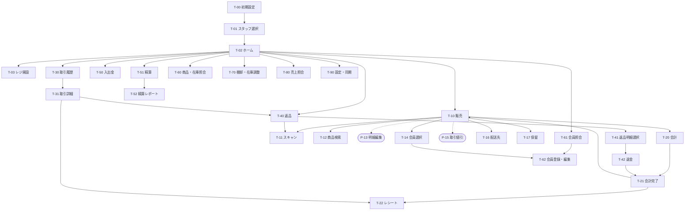

# 画面設計 (v0.2)

端末 (MAUI レジアプリ) と サーバ管理画面 (Blazor) の画面一覧。API は [api-design.md](api-design.md)、判断の経緯は [decisions.md](decisions.md)、プロジェクト構成は [architecture.md](architecture.md)。

- [1. 端末 (MAUI・スマートフォン)](#1-端末-mauiスマートフォン)
- [2. サーバ管理画面 (Blazor)](#2-サーバ管理画面-blazor)

優先度: ★ MVP / ◎ Phase 2。

---

## 1. 端末 (MAUI・スマートフォン)

### 1.1 前提

`template-maui-keyboard` (`Template.MobileApp`) の構成をそのまま使い、販売・会計画面のデザインは `template-maui` の POS 画面 (UIPosView) に倣う ([D-23](decisions.md#d-23-端末の画面骨格-template-maui-のシェル準拠))。

| 項目 | 内容 |
| --- | --- |
| 端末 | 通常のスマートフォン (Android、縦持ち・片手操作)。画面幅 360〜430 dp を想定 |
| 画面の骨格 | テンプレートのシェル: **上部タイトルバー + コンテンツ + 下部 F1〜F4 ファンクションキー**。各画面は `ContentView` で、`ShellProperty` でタイトルと F キーの文言・有効を宣言する。ハードウェアの戻るは `OnNotifyBackAsync` で処理 |
| ナビゲーション | Smart.Navigation の `ViewId` 列挙で遷移 (`Navigator.ForwardAsync(ViewId.Xxx)`)。パラメータは `NavigationParameter`。各画面に `[Hierarchy(n)]` を付け、階層が深くなる遷移は右から (Forward)、浅くなる遷移は左から (Back) スライドする ([D-36](decisions.md#d-36-端末の画面遷移アニメーション)) |
| ダイアログ | MauiComponents の `IDialog` (確認 / 情報 / 選択 / トースト / ローディング) と `IPopupNavigator` のポップアップ (`DialogId`)。**ボトムシートは使わない** |
| 数値入力 | テンプレートの `InputNumber` ポップアップ (テンキー、`NumberInputModel`) を数量・金額に流用。会計画面だけはテンキーを画面に埋め込む |
| スキャン | `BarcodeScanning.Native.Maui` (`BarcodeController` + `CameraView`)。1D (JAN/EAN) と 2D (QR) を連続読み取り。用途: 商品 JAN、会員証 (QR / バーコード)、レシート QR (返品時の取引呼び出し)、設定 QR |
| QR 表示 | `QRCoder` (テンプレートの QR Display と同じ) で電子レシートの QR を表示 |
| 設定 | `IPreferences` (`Settings`) にサーバ URL・店舗 ID・端末 ID を保存。管理画面の設定 QR (`Key=Value` 行、`SettingParser` 互換) で投入 ([D-24](decisions.md#d-24-端末セットアップ-qr-テンプレート互換フォーマット)) |
| 通信 | Rester の `HttpService` + `NetworkOperator` (接続確認・リトライ・エラー通知)。`XxxRequest` / `XxxResponse` は `Pos.Shared` を参照 |
| ローカル DB | Smart.Data.Accessor + SQLite (マスタキャッシュ・取引・Outbox、[db-design.md §6](db-design.md#6-端末ローカル-db-sqlite-の概要)) |
| レシート | **画面表示 + 電子レシート** (レシート番号を QR 化、画像 / PDF 共有) を基本にする。Bluetooth レシートプリンタ (ESC/POS) は Phase 2 |
| オフライン | 未送信件数をタイトルバーにバッジ表示。オンライン限定機能 (会員照会・他店在庫・レシート番号検索) は通信不可時にその旨を表示 |

### 1.2 ナビゲーション構成

**採用: メニュー型** (ホーム画面に機能ボタンのグリッド、各機能からは F1 / 戻るでホームへ)。利用者指定 ([D-17](decisions.md#d-17-端末のナビゲーション構成))。テンプレートの `MenuView` (2 列 × N 行の大きなボタン) と同じ作り。

代案も検討したので記録する:

| 案 | 内容 | 長所 | 短所 |
| --- | --- | --- | --- |
| ✅ **A. メニュー型** | ホーム = 機能ボタンのグリッド。販売・返品・精算などを選んで入る | 分かりやすい。機能追加が容易。テンプレートの `MenuView` がそのまま使える | 販売に入るのに毎回 1 タップ |
| B. 販売起点 + ドロワー (Square / Loyverse 型) | ログイン後すぐ販売画面。他機能はハンバーガーメニュー | レジ担当の操作の 9 割が販売なので最短 | 販売以外が隠れる。テンプレートのシェルにドロワーがない |
| C. ボトムタブ | 下部に 販売 / 取引 / 照会 / メニュー の 4 タブ | 頻出機能を常時表示 | F キー領域と競合する |

**提案 (折衷)**: A を採用しつつ、次の 2 点を入れると B の利点も取れる。

1. ホームのボタンは「販売」を最上段に 2 列分の幅で置く
2. 設定で「起動時 / ログイン時にシフト開設済みなら販売画面を直接開く」を選べるようにする

### 1.3 画面遷移



実線 = `ViewId` による画面遷移、点線 = ポップアップ (`DialogId`)。

`[Hierarchy(n)]` の n はこの図の深さ (T-00 = 0、T-01 = 1、T-02 = 2、ホーム直下 = 3、その下 = 4 …)。親が複数ある画面は最も深い親 + 1。遷移アニメーションはこの差で決まる ([D-36](decisions.md#d-36-端末の画面遷移アニメーション))。

### 1.4 画面一覧

F1〜F4 はシェル下部のファンクションキー。「—」は無効 (テンプレートどおり非表示ではなく無効ボタン)。

| ID | 画面 | 目的 | 主な要素・操作 | F1 | F2 | F3 | F4 | 使用 API | 優先 |
| --- | --- | --- | --- | --- | --- | --- | --- | --- | --- |
| T-00 | 初期設定 | 端末をサーバに紐付け、初回同期 | 設定 QR をスキャン (`ApiEndPoint` / `StoreId` / `TerminalId`) または手入力。店舗・端末名を表示して確認。初回同期の進捗 | — | QR 読取 | 手入力 | 開始 | `GET /stores/{id}`, `GET /terminals/{id}`, `GET /sync/masters`, `GET /inventory` | ★ |
| T-01 | スタッフ選択 | 担当者を決める | 所属店舗のスタッフ一覧 (`CollectionView`) をタップ。PIN 入力は Phase 2 (T-91) | 設定 | — | — | — | (ローカル) | ★ |
| T-02 | ホーム | 機能選択 | タイトルに店舗・端末・担当・未送信バッジ。ボタン: 販売 (2 列幅) / 返品 / 取引履歴 / レジ開設・精算 / 入出金 / 商品・在庫照会 / 会員 / 棚卸・在庫調整 / 売上照会 / 設定・同期。シフト未開設なら「販売」は開設へ誘導。F キー非表示 (テンプレートの `MenuView` と同じ) | | | | | `GET /shifts/current` | ★ |
| T-03 | レジ開設 | シフト開始 | 営業日、釣銭準備金 (`InputNumber`)、担当 | 戻る | — | — | 開設 | `POST /shifts` | ★ |
| T-10 | 販売 | 明細を組み立てる | 会員チップ (タップ → T-14)、明細リスト (タップ → P-13、左スワイプで削除)、小計・値引・合計、画面内ボタン [⋯] (取引値引 P-15 / 配送先 T-16 / 保留 T-17 / クリア) | メニュー | スキャン | 検索 | 会計 | (ローカル計算) | ★ |
| T-11 | スキャン | カメラで読み取り | 全画面 `CameraView`、**連続読み取り** (商品モードでは読むたびに明細追加してトーストで商品名表示、同じ商品は数量 +1)、検出フラッシュ (テンプレート)。モード: 商品 / 会員 / レシート / 設定 | 戻る | ライト | 手入力 | 完了 | `GET /products/lookup` (ローカル優先), `GET /customers/lookup`, `GET /transactions/lookup` | ★ |
| T-12 | 商品検索 | スキャンできない商品を探す | キーワード (名称 / 型番 / コード)、部門ブラウズ (2 階層)、結果タップで追加 | 戻る | 部門 | クリア | — | ローカル (`Products` キャッシュ) | ★ |
| P-13 | 明細編集 (ポップアップ) | 数量・値引など | 数量 −/+ と `InputNumber`、単価変更 (`AllowsPriceOverride` のみ)、明細値引 (定義済み選択 or 任意額・率 + 理由)、シリアル番号 (◎)、備考、削除、OK / キャンセル | | | | | (ローカル計算) | ★ |
| T-14 | 会員選択 | 取引に会員を紐付け | 検索 (会員番号・電話・名前)、結果一覧、選択後に残高表示 | 戻る | スキャン | 新規 | 解除 | `GET /customers/lookup`, `GET /customers` | ★ |
| P-15 | 取引値引 (ポップアップ) | 取引全体の値引 | 定義済み一覧 / 任意額・率 (`InputNumber`) + 理由 | | | | | (ローカル計算) | ★ |
| T-16 | 配送先 | 配送情報入力 | 宛名・電話・郵便番号・住所・希望日・時間帯・備考 | 戻る | 会員住所 | クリア | 確定 | — | ★ |
| T-17 | 保留・呼出 | 会計途中の一時退避 | 保留一覧 (端末ローカルのみ)、選択して呼出 / 破棄 | 戻る | — | 破棄 | 呼出 | — | ★ |
| T-20 | 会計 | 支払を受ける | 合計、ポイント利用 (残高表示)、支払済 / 残り、支払方法ボタン (横スクロール)、**埋め込みテンキー** + 金額ショートカット、[ちょうど]、支払リスト (複数可) | 戻る | ポイント | 会員 | 確定 | `POST /transactions` (Outbox 経由) | ★ |
| T-21 | 会計完了 | 釣銭と結果を見せる | 釣銭を大きく表示、付与ポイント・残高、次の会計へ | — | レシート | — | 次へ | — | ★ |
| T-22 | レシート | 印字内容の確認・発行 | レシートプレビュー (等幅フォント)、電子レシート QR (レシート番号)、共有 (画像 / PDF) | 戻る | 共有 | 印刷 (◎) | QR | — | ★ |
| T-30 | 取引履歴 | 当シフト / 日付の取引を探す | 一覧 (レシート番号・時刻・金額・種別・状態・送信状態)、日付 / 種別の絞り込み | 戻る | 絞込 | — | 再送 | ローカル + `GET /transactions` | ★ |
| T-31 | 取引詳細 | 内容確認と後処理 | 明細・支払・ポイント・配送、取消は同一シフト内のみ有効 | 戻る | レシート | 取消 | 返品 | `POST /transactions/{id}/void` | ★ |
| T-40 | 返品 | 元取引を呼び出す | レシート QR スキャン / 番号入力 / 履歴から選択 → 元取引を表示 | 戻る | スキャン | 番号入力 | 履歴 | `GET /transactions/lookup`, ローカル | ★ |
| T-41 | 返品明細選択 | 返す商品と数量 | 元明細ごとに返品数量 (残数量まで、`InputNumber`)、返金額・戻るポイントを自動表示、理由 | 戻る | 全数 | — | 次へ | (ローカル計算) | ★ |
| T-42 | 返金 | 返金方法 | 元の支払方法に応じた返金方法選択 (現金 / カード取消 / ポイント返還)、金額確認 | 戻る | — | — | 確定 | `POST /transactions` (`Type = Return`) | ★ |
| T-50 | 入出金 | 現金の出し入れ | 種別 (入金 / 出金 / ドロワ開) の選択、金額 (`InputNumber`)、理由 | 戻る | — | — | 確定 | `POST /shifts/{id}/cash-events` | ★ |
| T-51 | 精算 | シフト終了 | 集計 (現金売上・返金・入出金・予想現金)、未送信が残っていれば警告、実査金額 (`InputNumber` or 金種別)、過不足 | 戻る | 金種入力 | 未送信 | 精算 | `GET /shifts/{id}`, `POST /shifts/{id}/close` | ★ |
| T-52 | 精算レポート | 精算結果 | 支払方法別・税率別・部門別、過不足 | 戻る | 共有 | 印刷 (◎) | ホーム | `GET /shifts/{id}/summary` | ★ |
| T-60 | 商品・在庫照会 | 価格と在庫を答える | スキャン / 検索 → 価格・税・還元率・自店在庫、他店在庫 (オンライン、店舗別一覧) | 戻る | スキャン | 検索 | 他店在庫 | ローカル、`GET /inventory/{productId}` | ★ |
| T-61 | 会員照会 | 会員情報を見る | スキャン / 検索 → 基本情報・残高・ポイント履歴・購入履歴 | 戻る | スキャン | 検索 | 編集 | `GET /customers/{id}`, `.../points/history`, `.../transactions` | ★ |
| T-62 | 会員登録・編集 | 店頭での入会・変更 | 会員番号 (スキャン可)、氏名・かな・電話・メール・住所・生年月日 (テンプレートの Validation) | 戻る | スキャン | クリア | 保存 | `POST /customers`, `PUT /customers/{id}` | ★ |
| T-70 | 棚卸・在庫調整 | 実数登録・調整 | スキャン → 現在庫表示 → 実数 (棚卸) or 増減 + 理由 (調整) → リストに追加 → 送信 | 戻る | スキャン | モード | 送信 | `POST /inventory/changes` | ★ |
| T-80 | 売上照会 | 本日の状況 | 自端末 / 自店の本日売上、件数、支払方法別 | 戻る | 期間 | 範囲 | 更新 | `GET /reports/sales/summary` | ★ |
| T-90 | 設定・同期 | 端末管理 | 端末情報、最終同期時刻、未送信一覧 (要確認エラーの詳細・再送・破棄)、サーバ URL、スタッフ切替、「ログイン後に販売画面を開く」設定、診断 (テンプレートの `DiagnosticPanel`) | 戻る | QR 読取 | 未送信 | 同期 | `GET /sync/masters` | ★ |
| T-91 | PIN ログイン | 認証 | スタッフ選択後に PIN 入力 (`InputNumber`) | 戻る | — | — | — | `POST /auth/login` | ◎ |
| T-92 | 受注 | 取り寄せ・取り置き | 受注登録・一覧・入荷確認・会計への変換 | 戻る | | | | `/orders` | ◎ |

`DialogId` (ポップアップ) 一覧: `InputNumber` (テンプレート既存) / `LineEdit` (P-13) / `Discount` (P-15) / `ReasonSelect` (在庫調整理由・返品理由) / `Denominations` (金種別入力)。確認・選択・トーストは `IDialog` を使う。

### 1.5 主要画面のレイアウト案

テンプレートのシェル (上部タイトル、下部 F1〜F4) の上に描く。

#### T-10 販売

```
┌──────────────────────────────┐
│ 販売          S001-02 山田 ⚠2 │  タイトルバー: 端末 / 担当 / 未送信バッジ
├──────────────────────────────┤
│ 👤 佐藤 花子   8,074 pt      ✕ │  会員チップ (未設定なら「会員を選択」)
├──────────────────────────────┤
│ デジタルカメラ X-100           │  タップ → P-13 明細編集
│   ¥80,000 × 1  -¥4,000  ¥76,000│  左スワイプ → 削除
│ SD カード 64GB                 │
│   ¥2,000 × 2             ¥4,000│
│ 配送料                         │
│   ¥1,100 × 1             ¥1,100│
│                                │
├──────────────────────────────┤
│ 小計 ¥85,100   値引 -¥5,000 [⋯]│  ⋯ = 取引値引 / 配送先 / 保留 / クリア
│ 合計 ¥80,100  (内消費税 ¥7,281) │
├──────────────────────────────┤
│ [メニュー][スキャン][ 検索 ][ 会計 ]│  F1〜F4
└──────────────────────────────┘
```

- スキャン (T-11) は「読んだら即追加して継続」。同じ商品を続けて読むと数量 +1。F4 完了で販売画面に戻る
- 会員は会計画面 (F3) からも紐付けられる (ポイント利用のため)

#### T-20 会計

```
┌──────────────────────────────┐
│ 会計                           │
├──────────────────────────────┤
│ 合計                 ¥80,100   │
│ ポイント利用 [ 5,000 ] / 8,074 │  F2 ポイント → 利用額入力 (全額 / 入力)
│ 支払済               ¥55,000   │
│ 残り                 ¥25,100   │
├──────────────────────────────┤
│ ✓ ポイント      ¥5,000       ✕ │  支払リスト (複数可)
│ ✓ クレジット   ¥50,000 1234-… ✕ │
├──────────────────────────────┤
│ [現金] [クレジット] [QR] [電子マネー] [商品券] ›│  横スクロール
│ 預り金               ¥30,000   │
│ [ 7 ][ 8 ][ 9 ]  [ ¥10,000 ]   │  埋め込みテンキー (NumberInputModel)
│ [ 4 ][ 5 ][ 6 ]  [ ¥5,000 ]    │
│ [ 1 ][ 2 ][ 3 ]  [ ¥1,000 ]    │
│ [ 0 ][ 00 ][ ⌫ ] [ ちょうど ]  │
├──────────────────────────────┤
│ [ 戻る ][ポイント][ 会員 ][ 確定 ]│  F1〜F4 (F4 に釣銭を併記: 確定 ¥4,900)
└──────────────────────────────┘
```

- 現金以外は「残り」全額を既定値にし、`RequiresReference` の支払方法は伝票番号入力を求める
- 確定で取引を Outbox に保存し、即座に T-21 へ (送信完了を待たない)

#### T-11 スキャン

```
┌──────────────────────────────┐
│ スキャン (商品)                 │
├──────────────────────────────┤
│                                │
│      ┌────────────────┐        │
│      │  CameraView     │        │  枠内で連続読み取り、検出時にフラッシュ
│      └────────────────┘        │
│  ✓ SD カード 64GB を追加 (×2)  │  読み取り結果トースト
│                                │
├──────────────────────────────┤
│ [ 戻る ][ライト][手入力][ 完了 ]│  F1〜F4
└──────────────────────────────┘
```

#### T-02 ホーム

```
┌──────────────────────────────┐
│ ホーム        S001-02 山田 ⚠2 │
├──────────────────────────────┤
│ [          販売            ]  │  2 列幅
│ [   返品    ][  取引履歴   ]  │
│ [ レジ開設・精算 ][ 入出金  ]  │
│ [ 商品・在庫照会 ][  会員   ]  │
│ [ 棚卸・在庫調整 ][ 売上照会 ]  │
│ [        設定・同期         ]  │
│                                │
│  Development flavor  Version 1.0│  フッタ (テンプレート)
└──────────────────────────────┘
```

---

## 2. サーバ管理画面 (Blazor)

### 2.1 前提

`Service-CloudManager` (`CloudManager.Host`) の構成をそのまま使い、Aspire と OpenAPI を `template-blazor-server` から加える ([D-18](decisions.md#d-18-管理画面の構成))。

| 項目 | 内容 |
| --- | --- |
| 構成 | `MudLayout`: `MudAppBar` + `MudDrawer` (左ナビ、折りたたみ可) + `MudMainContent`。一覧ページ + 詳細 / 編集は `IDialogService` の**ダイアログ** |
| ホスティング | Blazor Web App (Interactive Server)。API と同じ ASP.NET Core に同居 (ポート 8080) |
| UI ライブラリ | **MudBlazor**。一覧は `MudDataGrid` (`ServerData` でサーバ側ページング・ソート。Accessor の件数 + ページ取得結果をそのまま渡す)、フォームは `MudForm` + FluentValidation (`Models/Forms/{Xxx}Form` + `{Xxx}FormValidator`)、通知は `ISnackbar`、確認は `DialogService.ShowConfirm` |
| ナビ | `MudNavMenu` + `MudNavGroup` でグループ化 (`CloudManager` と同じ書き方)。展開状態はページ側で保持 |
| データアクセス | ページは Accessor と `Pos.Domain` を `[Inject]` して直接呼ぶ (Service / Usecase は置かない、[D-19](decisions.md#d-19-技術スタックプロジェクト構成-テンプレート準拠))。HTTP API は経由しない |
| 認証 | ベースの `Service-CloudManager` には認証がないため MVP は認証なし。管理画面ログイン (Cookie) と役割制御は Phase 2 で `template-maui-server` を参考に追加 |
| 帳票 | CSV は CsvHelper の `PushStreamHttpResult` (`template-blazor-server`)、PDF は OysterReport (Phase 2) |

### 2.2 ナビゲーション構成

```
📊 ダッシュボード                S-01   /
📈 売上
   ├ 売上集計                    S-10   /reports/sales
   └ 商品別売上                  S-11   /reports/products
🧾 取引                          S-20   /transactions
💰 精算 (シフト)                 S-30   /shifts
📦 在庫
   ├ 現在庫                      S-40   /inventory
   ├ 在庫変動履歴                S-42   /inventory/changes
   └ 調整理由                    S-44   /inventory/reasons
🏷 商品
   ├ 商品                        S-50   /products
   ├ 部門                        S-53   /categories
   ├ 税率                        S-54   /tax-rates
   ├ 値引                        S-55   /discounts
   └ 支払方法                    S-56   /payment-methods
👥 顧客                          S-60   /customers
🏬 店舗
   ├ 店舗                        S-70   /stores
   ├ レジ端末                    S-71   /terminals
   └ スタッフ                    S-72   /staff
⚙ 設定
   ├ 会社設定                    S-80   /settings
   ├ 日次締め (◎)                S-90   /daily-closings
   ├ 受注 (◎)                    S-91   /orders
   └ ユーザー (◎)                S-92   /accounts
```

### 2.3 画面一覧

| ID | 画面 | 種別 | 主な要素・操作 | 対応 API | 優先 |
| --- | --- | --- | --- | --- | --- |
| S-00 | レイアウト | シェル | `MainLayout` (テンプレート): `MudAppBar` (アプリ名)、`MudDrawer` + `NavMenu`、`ErrorBoundary`、`ReconnectModal`。ログイン画面は Phase 2 | — | ★ |
| S-01 | ダッシュボード | ダッシュボード | KPI カード (`MudPaper`: 本日売上・客数・客単価・返品額)、店舗別売上表、開設中シフト一覧 (端末・担当・開設時刻)、端末の最終通信 (`LastSeenAt`)、警告 (在庫マイナス商品、ポイント残高マイナス顧客) | `GET /reports/sales/summary`, `GET /shifts?status=Open`, `GET /terminals`, `GET /inventory?negativeOnly` | ★ |
| S-10 | 売上集計 | 一覧 + グラフ | フィルタ (期間 `MudDateRangePicker`・店舗・`groupBy`)、`MudChart` (棒 / 折れ線)、集計表、CSV 出力、[売上日報 PDF] (店舗・営業日を指定、[D-37](decisions.md#d-37-帳票出力-pdf-oysterreport)) | `GET /reports/sales/summary`, `GET /reports/sales/daily/pdf` | ★ |
| S-11 | 商品別売上 | 一覧 | フィルタ (期間・店舗・部門)、ランキング表 (数量・売上・粗利)、CSV | `GET /reports/sales/products` | ★ |
| S-20 | 取引一覧 | 一覧 | フィルタ (期間・店舗・端末・担当・種別・状態・レシート番号・会員)、`MudDataGrid` (レシート番号・日時・合計・支払・状態)、行クリックで S-21 | `GET /transactions`, `GET /transactions/lookup` | ★ |
| S-21 | 取引詳細 | ダイアログ | ヘッダ情報、明細 (シリアル含む)、値引、税率別集計、支払、ポイント、配送先、関連取引 (元取引 / 返品取引 / 取消情報) へのリンク。参照のみ (取消・返品は端末で行う)。[レシート PDF] (◎) | `GET /transactions/{id}`, `GET /transactions/{id}/receipt/pdf` | ★ |
| S-30 | シフト一覧 | 一覧 | フィルタ (期間・店舗・端末・状態)、`MudDataGrid` (営業日・端末・担当・開設 / 精算時刻・予想 / 実査 / 過不足 — 過不足を `MudChip` で強調)、行クリックで S-31 | `GET /shifts` | ★ |
| S-31 | シフト詳細 | ダイアログ | 精算レポート (支払方法別・税率別・部門別)、入出金一覧、金種別枚数、取引一覧へのリンク、[精算レポート PDF] | `GET /shifts/{id}`, `.../summary`, `.../summary/pdf`, `.../cash-events` | ★ |
| S-40 | 現在庫 | 一覧 | フィルタ (店舗・部門・キーワード・「マイナスのみ」)、`MudDataGrid` (商品・店舗・数量・更新日時)、行クリックで S-41、[棚卸・調整] で S-43 | `GET /inventory` | ★ |
| S-41 | 商品別全店在庫 | ダイアログ | 店舗ごとの数量、変動履歴へのリンク | `GET /inventory/{productId}` | ★ |
| S-42 | 在庫変動履歴 | 一覧 | フィルタ (店舗・商品・種別・期間)、表 (日時・種別・増減・処理後・理由・参照取引) | `GET /inventory/changes` | ★ |
| S-43 | 棚卸・調整登録 | ダイアログ | 店舗、商品検索 (`MudAutocomplete`)、種別 (棚卸 / 調整)、数量、理由、備考 | `POST /inventory/changes` | ★ |
| S-44 | 調整理由 | 一覧 + 編集ダイアログ | コード・名称・並び順・有効 | `/inventory/adjustment-reasons` | ★ |
| S-50 | 商品一覧 | 一覧 | フィルタ (部門・キーワード・販売状態・削除済み表示)、`MudDataGrid` (コード・JAN・名称・部門・価格・税・還元率・在庫管理・状態)、[追加] / 行の編集アイコンで S-51、CSV 出力 | `GET /products`, `GET /products/csv` | ★ |
| S-51 | 商品編集 | ダイアログ | `ProductForm` (コード・JAN・名称・かな・メーカー・型番・部門・種別・価格・内税/外税・税率・原価・還元率・シリアル要・在庫管理・売価変更可・単位・販売可否)、画像 (◎)、[保存] [削除] | `POST/PUT/DELETE /products` | ★ |
| S-52 | 商品 CSV 取込 | ダイアログ | `MudFileUpload`、プレビュー、エラー表示 | `POST /products/import` | ◎ |
| S-53 | 部門 | ツリー + 編集ダイアログ | `MudTreeView` (2 階層)、並び順、[追加] [編集] [削除] | `/categories` | ★ |
| S-54 | 税率 | 一覧 + 編集ダイアログ | コード・名称・率・種別・既定 | `/tax-rates` | ★ |
| S-55 | 値引 | 一覧 + 編集ダイアログ | コード・名称・種別・値・適用範囲・承認要・有効 | `/discounts` | ★ |
| S-56 | 支払方法 | 一覧 + 編集ダイアログ | コード・名称・種別・釣銭・参照要・並び順・有効 (`Points` は 1 件のみの制約を表示) | `/payment-methods` | ★ |
| S-60 | 顧客一覧 | 一覧 | 検索 (会員番号・名前・電話)、`MudDataGrid` (会員番号・名前・電話・残高・登録日)、[追加]、行クリックで S-61 | `GET /customers` | ★ |
| S-61 | 顧客詳細 | ページ (`/customers/{id}`) | 基本情報 (編集ダイアログ)、ポイント残高、`MudTabs`: ポイント履歴 / 購入履歴、[ポイント調整] で S-62 | `GET/PUT /customers/{id}`, `.../points/history`, `.../transactions` | ★ |
| S-62 | ポイント調整 | ダイアログ | 増減、理由、担当 | `POST /customers/{id}/points/adjust` | ★ |
| S-70 | 店舗 | 一覧 + 編集ダイアログ | コード・名称・住所・電話・登録番号・レシート文言・タイムゾーン・有効 | `/stores` | ★ |
| S-71 | レジ端末 | 一覧 + 編集ダイアログ | 店舗・端末番号・名称・有効・最終通信・アプリ版・最終レシート連番、**[設定 QR 表示]** (テンプレートの `QrPage` と同じ生成方法で `ApiEndPoint` / `StoreId` / `TerminalId` を QR 化)、ペアリングコード発行 (◎) | `/terminals` | ★ |
| S-72 | スタッフ | 一覧 + 編集ダイアログ | コード・名前・役割・所属店舗・有効、PIN 設定 (◎) | `/staff` | ★ |
| S-80 | 会社設定 | フォーム | 会社名・通貨・税端数処理・ポイント付与基準・営業日切替時刻 | `GET/PUT /settings` | ★ |
| S-90 | 日次締め | 一覧 + 実行ダイアログ | 店舗 × 営業日、未精算シフトの警告、日計表示 | `/daily-closings` | ◎ |
| S-91 | 受注 | 一覧 + 編集 | 取り寄せ・取り置きの状態管理 | `/orders` | ◎ |
| S-92 | ユーザー | 一覧 + 編集 | 管理画面ログインユーザー (テンプレートの `Account`) | — | ◎ |

### 2.4 共通 UI パターン

| パターン | 内容 |
| --- | --- |
| 一覧 | 上部に検索・フィルタ (`MudTextField` / `MudSelect` / `MudDateRangePicker`)、`MudDataGrid` (`ServerData` + `MudDataGridPager`、列ソートはサーバ側)。検索条件はページ内で保持し、他画面からのリンクだけクエリで受ける (`transactions?id=` / `?shiftId=`、`inventory/changes?productId=`) |
| 絵文字・チップ・バッジ | ページ見出しは §2.2 のナビと同じ絵文字。状態は `StatusChip` (`ChipText` の文言 + 色: ✅ 完了 / ❌ 取消 / 🛒 販売 / ↩️ 返品 / 🟢 開設中 / 🔒 精算済み / ✅ 有効 / ⏸ 停止 / 🗑 削除済み / 🔴 マイナス / ⚠️ 欠品 / 🟢 通信中 ...)。件数は `MudBadge` とタブの `BadgeData`。KPI は `MudPaper` + `MudIcon` のカード ([D-39](decisions.md#d-39-管理画面の表現-絵文字チップバッジ)) |
| 編集ダイアログ | 新規と編集で同じダイアログ (`{Xxx}EditDialog` + `{Xxx}Form` + FluentValidation)。保存時に `Version` を送り、`VERSION_MISMATCH` なら「他で更新されています。再読み込みしてください」 |
| 削除 | `DialogService.ShowConfirm` → 論理削除。一覧に「削除済みを表示」トグル。使用中 (`IN_USE`) は Snackbar でメッセージ表示 |
| 店舗フィルタ | 売上・取引・精算・在庫の各一覧は店舗セレクタを持つ (「全店舗」可)。選択はページ間で共有するスコープドサービスに保持 |
| エラー表示 | Problem Details の `title` / `detail` を Snackbar に、フィールドエラーは `MudForm` の検証表示に |
| 出力 | 集計系・マスタは CSV ダウンロード (`/api/v1/.../csv`)。帳票は PDF (`/api/v1/.../pdf`、OysterReport、[D-37](decisions.md#d-37-帳票出力-pdf-oysterreport))。どちらも `MudButton Href` で開く |
