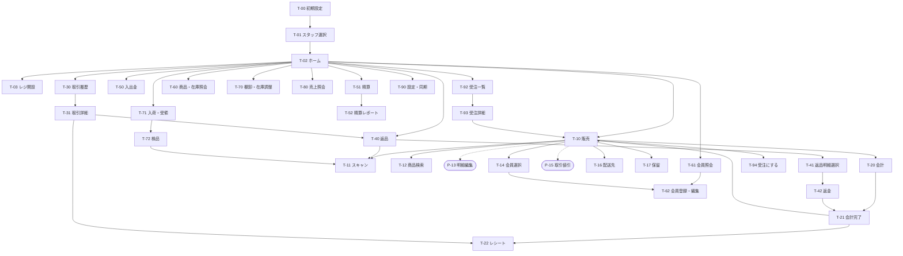

# 画面設計

端末 (MAUI レジアプリ) と サーバ管理画面 (Blazor) の画面一覧。  
API は [api-design.md](api-design.md)、設計判断は [decisions.md](decisions.md)、プロジェクト構成は [architecture.md](architecture.md)。

- [1. 端末 (MAUI・スマートフォン)](#1-端末-mauiスマートフォン)
- [2. サーバ管理画面 (Blazor)](#2-サーバ管理画面-blazor)

---

## 1. 端末 (MAUI・スマートフォン)

### 1.1 前提

シェル (上部タイトルバー + F1〜F4) と販売・会計画面のデザインは [D-23](decisions.md#d-23-端末の画面骨格-template-maui-のシェル準拠) / [D-43](decisions.md#d-43-端末シェルのデザイン-pos-画面に合わせる)。

| 項目 | 内容 |
| --- | --- |
| 端末 | 通常のスマートフォン (Android、縦持ち・片手操作)。画面幅 360〜430 dp を想定 |
| 画面の骨格 | シェル: **上部タイトルバー + コンテンツ + 下部 F1〜F4 ファンクションキー**。各画面は `ContentView` で、`ShellProperty` でタイトルと F キーの文言・有効を宣言する。ハードウェアの戻るは `OnNotifyBackAsync` で処理 |
| シェルのデザイン | タイトルバーは紺 (`BlueDarken4`)。機能名は左寄せ、右に「店舗-端末 担当」と未送信バッジ。F キーはヘッダと同じ紺のバーに F1 = 戻る系 (灰青) / F2・F3 = 操作 (青) / F4 = 主操作 (橙)、無効は灰。ホームは白の平らなキーを罫線で区切り、「販売」だけ青。ポップアップの下段ボタンも同じ配色 (キャンセル = 灰青 / 確定 = 橙 / 削除 = 赤) ([D-43](decisions.md#d-43-端末シェルのデザイン-pos-画面に合わせる)) |
| ナビゲーション | Smart.Navigation の `ViewId` 列挙で遷移 (`Navigator.ForwardAsync(ViewId.Xxx)`)。パラメータは `NavigationParameter`。各画面に `[Hierarchy(n)]` を付け、階層が深くなる遷移は右から (Forward)、浅くなる遷移は左から (Back) スライドする ([D-36](decisions.md#d-36-端末の画面遷移アニメーション)) |
| ダイアログ | MauiComponents の `IDialog` (確認 / 情報 / トースト / ローディング) と `IPopupNavigator` のポップアップ (`DialogId`)。確認と情報は `IDialog` を実装する `SheetDialog` が `Confirm` / `Message` のシートに変換し、OS のダイアログを出さない。ポップアップは画面の下端に寄せたシート (幅いっぱい、上角が丸い。CommunityToolkit の Popup なので重ねて開ける)。一覧からの選択 (操作メニュー・絞り込み・承認者) も OS のダイアログではなく `Select` シートで行う ([D-50](decisions.md#d-50-端末のポップアップは下端に寄せたシート)) |
| 画面の組み方 | 灰色の背景に見出し (絵文字付き) を置き、その下に幅いっぱいの白い面を並べる (`SectionPanel`、`PosSectionTemplate`)。主な金額 (純売上・お釣り・合計) は白い帯に大きく出し、件数や金額の集計は罫線で区切った表にする。角丸の箱 (カード) は並べず、角丸はチップ・アバター・ボタン・下端のシートだけに使う ([D-59](decisions.md#d-59-端末の画面の表現-平らな面に状態と動きを足す)) |
| 一覧の行 | 状態のある一覧 (取引履歴・未送信・保留・棚卸・返品明細) は左端の帯と行の背景で状態を示し、区切り線で並べる。状態は色付きのチップ (`StatusChip`)、コードは等幅、会員はイニシャルのアバターで示す。タップできる行は波紋を出す |
| 記号 | 明るい背景 (見出し・一覧・メニュー・ホームのキー) の記号は色付きの絵文字にし、標準で文字の形になる記号 (ℹ️ ⚙️ ↩️ ▶️ ⏸️ など) には U+FE0F を付ける。塗りつぶしのチップや色付きのボタン (検索・番号入力・削除・ホームの販売) の記号は白い単色のアイコン (Material Icons) にする。選択で背景が濃くなる入出金の種別ボタンは、選択中だけアイコンを白にする ([D-60](decisions.md#d-60-濃い背景の記号は白いアイコンにする)) |
| 動き | 合計・お釣り・純売上は数え上げ、販売の合計は変わったときに背景を光らせる。未送信バッジは要確認があると拡縮を繰り返す。面と一覧は表示時に下から浮き上がらせる (続けて更新する販売の明細と棚卸には付けない) |
| 空の状態 | 一覧やスキャン待ちで表示するものが無いときは、絵文字 (🔍 商品 / 👤 会員 / 📦 棚卸 / 🧾 取引履歴 / ↩️ 返品) と案内文を中央に出す (`PosEmptyStack`)。会計の支払リストが空のときも案内文を出す。オンラインで取る画面 (売上照会・会員照会) の集計中と取得できないときは、結果の上に案内を重ねる |
| アイコン・スプラッシュ | 紺 (`BlueDarken4`) の背景に白いレジのグリフ (`Resources/AppIcon`、`Resources/Splash`) |
| 数値入力 | **OS のソフトキーボードに依存しない** ([D-44](decisions.md#d-44-入力はキーボードに依存しない-数値番号は電卓ボタン))。数量・金額・枚数・番号 (電話・郵便番号・コード・伝票番号・生年月日) はすべて `InputNumber` ポップアップ (電卓、`NumberInputModel`) で入力し、入力欄はタップで電卓を開くボタンにする。会計画面だけはテンキーを画面に埋め込む。検索欄にも 🔢 (番号入力) を置く。文字 (名前・住所・備考・検索キーワード) だけ `Entry` で、キーボードは欄をタップしたときだけ出す (遷移時の自動フォーカスはしない) |
| スキャン | `BarcodeScanning.Native.Maui` (`BarcodeController` + `CameraView`)。1D (JAN/EAN) と 2D (QR) を連続読み取り。用途: 商品 JAN、会員証 (QR / バーコード)、レシート QR (返品時の取引呼び出し)、設定 QR |
| QR 表示 | `QRCoder` で電子レシートの QR を表示 |
| 設定 | `IPreferences` (`Settings`) にサーバ URL・店舗 ID・端末 ID を保存。管理画面の設定 QR (`Key=Value` 行、`SettingParser` 互換) で投入 ([D-24](decisions.md#d-24-端末セットアップ-qr-テンプレート互換フォーマット)) |
| 通信 | `HttpService` (HttpClient + System.Text.Json、[D-40](decisions.md#d-40-端末の通信-rester-ではなく-httpclient)) + `NetworkService` (接続確認・インジケータ・エラー通知)。`XxxRequest` / `XxxResponse` は `Pos.Contract` を参照 |
| ローカル DB | Smart.Data.Accessor + SQLite (マスタキャッシュ・取引・Outbox、[db-design.md §6](db-design.md#6-端末ローカル-db-sqlite-の概要)) |
| レシート | **画面表示 + 電子レシート** (レシート番号を QR 化)。レシート画像と精算レポートのテキストは共有できる |
| オフライン | 未送信件数をタイトルバーにバッジ表示。オンライン限定機能 (会員照会・他店在庫・レシート番号検索) は通信不可時にその旨を表示 |

### 1.2 ナビゲーション構成

メニュー型 ([D-17](decisions.md#d-17-端末のナビゲーション構成))。  
ホームに機能キーのグリッドを置き、各機能からは F1 (戻る / メニュー) でホームへ戻る。

- ホームのキーは「販売」を最上段に 2 列分の幅で置く
- 設定「ログイン後にシフト開設済みなら販売画面を開く」で販売画面を直接開ける

### 1.3 画面遷移



実線 = `ViewId` による画面遷移、点線 = ポップアップ (`DialogId`)。

`[Hierarchy(n)]` の n はこの図の深さ (T-00 = 0、T-01 = 1、T-02 = 2、ホーム直下 = 3、その下 = 4 …)。  
親が複数ある画面は最も深い親 + 1。  
遷移アニメーションはこの差で決まる ([D-36](decisions.md#d-36-端末の画面遷移アニメーション))。

### 1.4 画面一覧

F1〜F4 はシェル下部のファンクションキー。  
「—」は無効。

| ID | 画面 | 目的 | 主な要素・操作 | F1 | F2 | F3 | F4 | 使用 API |
| --- | --- | --- | --- | --- | --- | --- | --- | --- |
| T-00 | 初期設定 | 管理画面で発行したペアリングコードで端末を登録し、初回同期 | 設定 QR をスキャン (`ApiEndPoint` / `PairingCode`) するか、サーバ URL を入れてコードを電卓で入力。登録した店舗・端末名を表示し、初回同期の進捗 | — | QR 読取 | コード | 登録 | `POST /terminals/pair`, `GET /sync/masters`, `GET /inventory` |
| T-01 | スタッフ選択 | 担当者を決める | 所属店舗のスタッフ一覧 (`CollectionView`) をタップし、PIN を電卓 (伏せ字) で入力。PIN 未設定のスタッフはチップ「PIN 未設定」を出し、選べない | 設定 | — | — | — | (ローカル) |
| T-02 | ホーム | 機能選択 | タイトルに店舗・端末・担当・未送信バッジ。ボタン: 販売 (2 列幅) / 返品 / 取引履歴 / レジ開設・精算 / 入出金 / 商品・在庫照会 / 会員 / 棚卸・在庫調整 / 入荷・受領 / 受注 / 売上照会 / 設定・同期 (2 列幅)。シフト未開設なら「販売」は開設へ誘導。F キー非表示 | | | | | `GET /shifts/current` |
| T-03 | レジ開設 | シフト開始 | 営業日、釣銭準備金 (`InputNumber`)、担当 | 戻る | — | — | 開設 | `POST /shifts` |
| T-10 | 販売 | 明細を組み立てる | 会員チップ (タップ → T-14)、明細リスト (タップ → P-13、左スワイプで削除)、小計・値引・合計、画面内ボタン [⋯] (取引値引 P-15 / 配送先 T-16 / 保留 T-17 / 受注にする T-94 / クリア)。受注から会計しているときは会員の下に受注番号の帯 | メニュー | スキャン | 検索 | 会計 | (ローカル計算) |
| T-11 | スキャン | カメラで読み取り | 全画面 `CameraView`、**連続読み取り** (商品モードでは読むたびに明細追加してトーストで商品名表示、同じ商品は数量 +1)。モード: 商品 / 会員 / レシート / 設定 | 戻る | ライト | 手入力 | 完了 | `GET /products/lookup` (ローカル優先), `GET /customers/lookup`, `GET /transactions/lookup` |
| T-12 | 商品検索 | スキャンできない商品を探す | キーワード (名称 / 型番 / コード)、部門ブラウズ (2 階層)、結果 (左に画像のサムネイル。ないときは記号) タップで追加 | 戻る | 部門 | クリア | — | ローカル (`Products` キャッシュ)、画像は `GET /products/{id}/image` (結果を出した後に上から入れる。取得した画像は端末に置き、オフラインはそれだけ) |
| P-13 | 明細編集 (ポップアップ) | 数量・値引など | 数量 −/+ と `InputNumber`、単価変更 (`AllowsPriceOverride` のみ)、明細値引 (定義済み選択 or 任意額・率 + 理由)、シリアル番号、備考、削除、OK / キャンセル | | | | | (ローカル計算) |
| T-14 | 会員選択 | 取引に会員を紐付け | 検索 (会員番号・電話・名前)、結果一覧、選択後に残高表示 | 戻る | スキャン | 新規 | 解除 | `GET /customers/lookup`, `GET /customers` |
| P-15 | 値引 (ポップアップ) | 取引全体または明細の値引 | 定義済み一覧 / 任意額・率 (`InputNumber`) + 理由 (`ReasonSelect`) | | | | | (ローカル計算) |
| T-16 | 配送先 | 配送情報入力 | 宛名・電話・郵便番号・住所・希望日・時間帯・備考 | 戻る | 会員住所 | クリア | 確定 | — |
| T-17 | 保留・呼出 | 会計途中の一時退避 | 保留一覧 (端末ローカルのみ)、選択して呼出 / 破棄 | 戻る | — | 破棄 | 呼出 | — |
| T-20 | 会計 | 支払を受ける | 合計、ポイント利用 (残高表示)、支払済 / 残り、支払方法ボタン (文言は支払方法の `shortName`、なければ `name`)、**埋め込みテンキー** + 金額ショートカット、[ちょうど]、支払リスト (複数可) | 戻る | ポイント | 会員 | 確定 | `POST /transactions` (Outbox 経由) |
| T-21 | 会計完了 | 釣銭と結果を見せる | 釣銭を大きく表示 (数え上げ)、販売は合計とお預り、付与ポイント・残高、次の会計へ | — | レシート | — | 次へ | — |
| T-22 | レシート | 印字内容の確認・発行 | レシートプレビュー (等幅フォント)、電子レシート QR (レシート番号)、共有 (画像) | 戻る | 共有 | 印刷 | QR | — |
| T-30 | 取引履歴 | 当シフト / 日付の取引を探す | 一覧 (レシート番号・時刻・金額・種別・状態・送信状態)、日付 / 種別の絞り込み、シリアル番号の検索 (オンライン) | 戻る | 絞込 | — | 再送 | ローカル、`GET /transactions?serialNumber=` |
| T-31 | 取引詳細 | 内容確認と後処理 | 明細・支払・ポイント・配送、取消は同一シフト内のみ有効 (理由は `ReasonSelect`) | 戻る | レシート | 取消 | 返品 | `POST /transactions/{id}/void` |
| T-40 | 返品 | 元取引を呼び出す | レシート QR スキャン / 番号入力 (自店の端末番号 + 連番を電卓で) / 履歴から選択 → 元取引を表示 | 戻る | スキャン | 番号入力 | 履歴 | `GET /transactions/lookup`, ローカル |
| T-41 | 返品明細選択 | 返す商品と数量 | 元明細ごとに返品数量 (残数量まで、`InputNumber`)、返金額・戻るポイントを自動表示、理由 | 戻る | 全数 | — | 次へ | (ローカル計算) |
| T-42 | 返金 | 返金方法 | 元の支払方法に応じた返金方法選択 (現金 / カード取消 / ポイント返還)、金額確認 | 戻る | — | — | 確定 | `POST /transactions` (`Type = Return`) |
| T-50 | 入出金 | 現金の出し入れ | 種別 (入金 / 出金 / ドロワ開) の選択、金額 (`InputNumber`)、理由 (`ReasonSelect`) | 戻る | — | — | 確定 | `POST /shifts/{id}/cash-events` |
| T-51 | 精算 | シフト終了 | 集計 (現金売上・返金・入出金・予想現金)、未送信が残っていれば警告、実査金額 (`InputNumber` or 金種別)、過不足 | 戻る | 金種入力 | 未送信 | 精算 | `GET /shifts/{id}`, `POST /shifts/{id}/close` |
| T-52 | 精算レポート | 精算結果 | 支払方法別・税率別・部門別、過不足 | 戻る | 共有 | 印刷 | ホーム | `GET /shifts/{id}/summary` |
| T-60 | 商品・在庫照会 | 価格と在庫を答える | スキャン / 検索 → 画像 (あるときだけ上に出す)・価格・税・還元率・自店在庫、他店在庫 (オンライン、店舗別一覧) | 戻る | スキャン | 検索 | 他店在庫 | ローカル、`GET /products/{id}/image`、`GET /inventory/{productId}` |
| T-61 | 会員照会 | 会員情報を見る | スキャン / 検索 → 基本情報・残高・ポイント履歴・購入履歴 | 戻る | スキャン | 検索 | 編集 | `GET /customers/{id}`, `.../points/history`, `.../transactions` |
| T-62 | 会員登録・編集 | 店頭での入会・変更 | 会員番号 (スキャン可)、氏名・かな・電話・メール・住所・生年月日 | 戻る | スキャン | クリア | 保存 | `POST /customers`, `PUT /customers/{id}` |
| T-70 | 棚卸・在庫調整 | 実数登録・調整 | スキャン → 現在庫表示 → 実数 (棚卸) or 増減 + 理由 (調整) → リストに追加 → 送信 | 戻る | スキャン | モード | 送信 | `POST /inventory/changes` |
| T-71 | 入荷・受領 | 自店に届いた伝票を選ぶ (オンライン) | 自店の入荷予定と自店宛に出荷済みの移動の一覧。行は左端の帯と種類のチップ (入荷 / 移動)、仕入先か出荷店、入荷予定日か出荷日時、納品書番号か移動番号、商品。タップで T-72 | 戻る | — | — | 更新 | `GET /inventory/receipts?status=Draft`, `GET /inventory/transfers?status=Shipped` |
| T-72 | 検品 | 届いた数を確かめて受領する (オンライン) | 伝票 (仕入先か出荷店・種類・番号) と確認した明細の数、コード入力。明細は左端の帯と行の背景で状態 (未確認 / 一致 / 不足 / 過剰) を示し、届いた数と予定の数・差。スキャンか JAN / 商品コードで明細を選ぶか、行をタップして届いた数を電卓で入れる | 戻る | スキャン | — | 受領 | `POST /inventory/receipts/{id}/receive`, `POST /inventory/transfers/{id}/receive` |
| T-80 | 売上照会 | 本日の状況 | 自端末 / 自店の本日売上、件数、支払方法別 | 戻る | 期間 | 範囲 | 更新 | `GET /reports/sales/summary` |
| T-92 | 受注一覧 | 自店の受注を探す (オンライン) | 受注番号 / 宛名 / 電話の検索、状態の絞り込み (未完了 / 入荷待ち / 引き渡し待ち / 完了 / キャンセル / すべて)、行は左端の帯と背景で状態を示し、状態・種別のチップ、宛名・金額・受注番号・商品・希望日 | 戻る | 絞込 | — | 更新 | `GET /orders` |
| T-93 | 受注詳細 | 入荷・キャンセル・会計 (オンライン) | お客様・金額・状態・種別・受注番号、お客様 (電話・希望日・備考)、明細、経過 (受注・入荷・完了・キャンセル) | 戻る | 入荷 | キャンセル | 会計へ | `GET /orders/{id}`, `POST /orders/{id}/arrive`, `.../cancel` |
| T-94 | 受注にする | 販売のカートを受注にする (オンライン) | カートの要約と会員、種別 (取り寄せ / 取り置き)、宛名 (会員の名前が初期値)、電話 (電卓)、希望日、備考 | 戻る | — | — | 登録 | `POST /orders` |
| T-90 | 設定・同期 | 端末管理 | 端末情報 (登録日時)、最終同期時刻、未送信一覧 (要確認エラーの詳細・再送・破棄)、サーバ URL、スタッフ切替、登録の解除、「ログイン後に販売画面を開く」設定 | 戻る | QR 読取 | 未送信 | 同期 | `GET /sync/masters` |

`DialogId` (ポップアップ) 一覧: `InputNumber` / `LineEdit` (P-13) / `Discount` (P-15) / `ReasonSelect` (在庫調整理由・返品理由・取消理由・入出金と値引の理由) / `Select` (一覧からの選択。操作メニュー・絞り込み・時間帯・増減・承認者・未送信の操作) / `Denominations` (金種別入力) / `Message` (情報) / `Confirm` (確認)。  
確認・情報・トーストは `IDialog` を使う (確認と情報は `SheetDialog` が `Confirm` / `Message` のシートで出す)。

補足:

| 画面 | 内容 |
| --- | --- |
| 共通 | 画面遷移は `ForwardAsync` のみ。複数の画面から使う画面 (T-11 / T-12 / T-14 / T-22 / T-40 / T-62) は `Parameters.WithReturnTo` で戻り先を受け取る。タイトル・F キーの文言や有効状態は `shell:ShellProperty.*="{Binding ...}"` で動的に変えられる。ポップアップの中から開くのは電卓 (`InputNumber`)・理由 (`ReasonSelect`)・一覧からの選択 (`Select`) のシートだけにし、数量・単価・値引の値・金種の枚数は電卓で入力する。一覧からの選択は `IPopupNavigator.ChooseAsync` (`Select` シート) を使う |
| T-02 | シフト未開設で販売 / 返品 / 入出金を選ぶと開設へ誘導し、開設後は元の画面へ。「レジ開設・精算」はシフト状態で文言が変わる |
| T-03 | サーバに開設中のシフトが残っていれば (再インストール時など) 引き継ぐ |
| T-10 | [⋯] は `Select` シート (取引値引 / 解除 / 配送先 / 保留する / 保留を呼び出す / 受注にする / クリア)。受注から会計しているカートでは「受注にする」を出さない。シリアル番号が未入力の明細があると会計に進まず、案内のあとにその明細の P-13 を開く |
| T-11 | 同一コードは 2 秒間抑制。検出フラッシュは省き、バイブレーションで知らせる。手入力は電卓 (`InputNumber`) |
| T-01 | PIN は同期したハッシュで照合するので、オフラインでもログインできる。3 回違えば担当の選択に戻る。どの画面でも要求が 401 になったら、登録が解除されたと知らせてトークンを捨て、T-00 へ戻る (未送信は残り、登録し直すと送る) |
| P-13 | 数量・単価は電卓 (`InputNumber`)、明細値引は取引値引と同じ P-15 (定義済み / 任意額 / 任意率 + 理由)。承認が必要な値引は店長 / 管理者を承認者に選び、その PIN を入れる |
| T-20 | 金額ショートカットは預り金に加算、[ちょうど] は残り全額。支払が済むと「残り」の行がお釣りになる |
| T-22 | 受注から会計した取引は受注番号を印字する。プレビューは `ReceiptTextBuilder` の 32 桁テキストを SkiaSharp で桁位置描画した画像 (端末フォントが等幅でなくても崩れない)。共有は PNG。描画は背景スレッド (`Task.Run`) で行い、終わるまでインジケータを出す。シリアル番号で探した他の店舗・端末の取引は、その店舗と端末で組み立てる。[印刷] は Bluetooth ラインプリンタを前提にしていて、今は押すと「印刷は未実装です」と知らせる ([D-68](decisions.md#d-68-端末の印刷は-bluetooth-ラインプリンタを前提にし今は作らない)) |
| T-30 | 絞り込みは画面上部のボタン (期間: 本シフト / 本日 / 昨日 / すべて、種別) で、その下に件数の内訳をチップで出す。行は種別・送信状態・会員のチップと時刻・担当・支払を示し、右端で明細と支払を展開する。送信状態は Outbox から (送信済 / 未送信 / 要確認)。最上段の検索欄でシリアル番号 (完全一致) を探すと、一覧をサーバの全店の取引に置き換える (件数は「シリアル n 件」)。空で検索するか期間・種別を選び直すと端末の履歴に戻る |
| T-31 | レジ係の取消は、確認のあとに店長 / 管理者を承認者に選び、その PIN を入れる (`approvedByStaffId`)。明細にシリアル番号 (S/N) を表示し、受注から会計した取引は受注番号の欄を出す。端末にない取引 (シリアル番号で探した他の端末の取引) はオンラインのときにサーバから開く。営業日が締め済みの取消はサーバが拒否し (`DAY_CLOSED`)、未送信の要確認に出る (端末は締めの状態を持たないので事前には知らせない) |
| T-42 | ポイント返還は自動 (利用ポイント分)、残りは返金方法を 1 つ選ぶ (元の支払方法を先頭に) |
| T-51 / T-52 | 予想現金はローカルの取引・入出金から (`ShiftSummaryCalculator`)。精算レポートは未送信がなければサーバの集計、あれば端末の集計。[印刷] は T-22 と同じく未実装と知らせる |
| T-62 | スキャン (T-11) へ行く間の入力内容は `CustomerDraft` (Scope) に残す |
| T-70 | 棚卸 / 調整のモードと入力リストは `StockContext` (Scope) に置き、スキャン画面との往復で失わない。コードは電卓かスキャンで入力する |
| T-71 / T-72 | オンライン限定 ([D-71](decisions.md#d-71-入荷と店舗間移動-伝票で持ち受領出荷で在庫を動かす))。検品中の伝票と数えた数は `ReceivingContext` (Scope) に置き、スキャン画面との往復で失わない。伝票にない商品は受け付けない。数えていない明細は予定 (移動は出荷) の数で受け取り、受領の確認でその件数を知らせる。受領したら在庫の差分同期をすぐ行う |
| T-80 | 範囲は 自端末 / 自店 / 全店。自端末は端末別集計から自分の行を出す (集計軸は選べない)。合計は日別集計の Total を使う。純売上を白い帯に、件数・値引・税・会員・ポイントを罫線の表に、集計軸の内訳を純売上に対する割合のバーで示す |
| T-92 / T-93 | オンライン限定。取得中と取得できないときは結果の上に案内を重ねる。[会計へ] (引き渡し待ちのとき) は明細と会員をカートに入れて T-10 へ進む (レジ未開設なら案内。販売中の明細があれば置き換えるか確かめる)。単価は売価を変更できる商品だけ受注の単価にする。キャンセルの理由は `ReasonSelect` |
| T-94 | 登録するとカートを空にして T-10 に戻り、受注番号を知らせる。会員がいなければ宛名が必要 |
| T-90 | スタッフ切替は T-01 へ。登録の解除はトークンを捨てて T-00 へ (ローカル DB と未送信は残す)。F2 QR 読取は設定 QR を読んで T-00 へ渡す (登録し直し) |

### 1.5 主要画面のレイアウト案

シェル (上部タイトル、下部 F1〜F4) の上に描く。

#### T-10 販売

```
┌──────────────────────────────┐
│ 販売          S001-02 山田 ⚠2 │  タイトルバー: 端末 / 担当 / 未送信バッジ
├──────────────────────────────┤
│ 👤 佐藤 花子   8,074 pt      ✕ │  会員チップ (未設定なら「会員を選択」)
├──────────────────────────────┤
│ デジタルカメラ X-100           │  タップ → P-13 明細編集
│   ¥80,000 × 1  -¥4,000  ¥76,000│  左スワイプ → 削除
│ SD カード 64GB                 │
│   ¥2,000 × 2             ¥4,000│
│ 配送料                         │
│   ¥1,100 × 1             ¥1,100│
│                                │
├──────────────────────────────┤
│ 小計 ¥85,100   値引 -¥5,000 [⋯]│  ⋯ = 取引値引 / 配送先 / 保留 / クリア
│ 合計 ¥80,100    内消費税 ¥7,281 │
├──────────────────────────────┤
│ [メニュー][スキャン][ 検索 ][ 会計 ]│  F1〜F4
└──────────────────────────────┘
```

- スキャン (T-11) は「読んだら即追加して継続」。  
  同じ商品を続けて読むと数量 +1。  
  F4 完了で販売画面に戻る
- 会員は会計画面 (F3) からも紐付けられる (ポイント利用のため)
- 合計は変わるたびに数え上げ、背景を一瞬光らせる

#### T-20 会計

```
┌──────────────────────────────┐
│ 会計                           │
├──────────────────────────────┤
│ 合計                 ¥80,100   │
│ ポイント利用 [ 5,000 ] / 8,074 │  F2 ポイント → 利用額入力 (全額 / 入力)
│ 支払済               ¥55,000   │
│ 残り                 ¥25,100   │
├──────────────────────────────┤
│ ✓ ポイント      ¥5,000       ✕ │  支払リスト (複数可)
│ ✓ クレジット   ¥50,000 1234-… ✕ │
├──────────────────────────────┤
│ [現金] [クレジット] [QR] [電子マネー] [商品券] ›│  横スクロール
│ 預り金               ¥30,000   │
│ [ 7 ][ 8 ][ 9 ]  [ ¥10,000 ]   │  埋め込みテンキー (NumberInputModel)
│ [ 4 ][ 5 ][ 6 ]  [ ¥5,000 ]    │
│ [ 1 ][ 2 ][ 3 ]  [ ¥1,000 ]    │
│ [ 0 ][ 00 ][ ⌫ ] [ ちょうど ]  │
├──────────────────────────────┤
│ [ 戻る ][ポイント][ 会員 ][ 確定 ]│  F1〜F4 (F4 に釣銭を併記: 確定 ¥4,900)
└──────────────────────────────┘
```

- 現金以外は「残り」全額を既定値にし、`RequiresReference` の支払方法は伝票番号入力を求める
- 確定で取引を Outbox に保存し、即座に T-21 へ (送信完了を待たない)

#### T-11 スキャン

```
┌──────────────────────────────┐
│ スキャン (商品)                 │
├──────────────────────────────┤
│                                │
│      ┌────────────────┐        │
│      │  CameraView     │        │  枠内で連続読み取り、検出時にフラッシュ
│      └────────────────┘        │
│  ✓ SD カード 64GB を追加 (×2)  │  読み取り結果トースト
│                                │
├──────────────────────────────┤
│ [ 戻る ][ライト][手入力][ 完了 ]│  F1〜F4
└──────────────────────────────┘
```

#### T-02 ホーム

```
┌──────────────────────────────┐
│ ホーム        S001-02 山田 ⚠2 │
├──────────────────────────────┤
│ [          販売            ]  │  2 列幅
│ [   返品    ][  取引履歴   ]  │
│ [ レジ開設・精算 ][ 入出金  ]  │
│ [ 商品・在庫照会 ][  会員   ]  │
│ [ 棚卸・在庫調整 ][ 入荷・受領 ]  │
│ [    受注     ][ 売上照会  ]  │
│ [        設定・同期         ]  │  2 列幅
│                                │
│  Development flavor  Version 1.0│  フッタ
└──────────────────────────────┘
```

---

## 2. サーバ管理画面 (Blazor)

### 2.1 前提

`Service-CloudManager` (`CloudManager.Host`) の構成をそのまま使い、Aspire と OpenAPI を `template-blazor-server` から加える ([D-18](decisions.md#d-18-管理画面の構成))。

| 項目 | 内容 |
| --- | --- |
| 構成 | `MudLayout`: `MudAppBar` + `MudDrawer` (左ナビ、折りたたみ可) + `MudMainContent`。一覧ページ + 詳細 / 編集は `IDialogService` の**ダイアログ** |
| ホスティング | Blazor Web App (Interactive Server)。API と同じ ASP.NET Core に同居 (ポート 8080) |
| UI ライブラリ | **MudBlazor**。一覧は `MudDataGrid` (`ServerData` でサーバ側ページング・ソート。Accessor の件数 + ページ取得結果をそのまま渡す)、フォームは `MudForm` + FluentValidation (`Models/Forms/{Xxx}Form` + `{Xxx}FormValidator`)、通知は `ISnackbar`、確認は `DialogService.ShowConfirm` |
| ナビ | `MudNavMenu` + `MudNavGroup` でグループ化。展開状態はページ側で保持 |
| データアクセス | ページは `Services/` の Service を `[Inject]` して呼ぶ (Accessor はページから使わない、[D-45](decisions.md#d-45-サーバの-service-層))。HTTP API は経由しない |
| 認証 | ログイン (Cookie)。役割は管理者 / オペレーター。オペレーターにはマスタ・会社設定・ユーザー・端末登録・PIN・締めの解除の操作を出さない ([D-73](decisions.md#d-73-認証と端末登録-管理画面はログイン端末はペアリングのトークンスタッフは-pin), [D-74](decisions.md#d-74-認可-ポリシーは要件で分け端末は自店自端末の操作だけ)) |
| 帳票 | CSV は CsvHelper (`PushStreamHttpResult`)、PDF は OysterReport ([D-37](decisions.md#d-37-帳票出力-pdf-oysterreport)) |

### 2.2 ナビゲーション構成

```
📊 ダッシュボード                S-01   /
📈 売上
   ├ 売上集計                    S-10   /reports/sales
   └ 商品別売上                  S-11   /reports/products
🧾 取引
   ├ 取引                        S-20   /transactions
   └ 受注                        S-91   /orders
💰 精算
   ├ シフト                      S-30   /shifts
   └ 日次締め                    S-90   /daily-closings
📦 在庫
   ├ 現在庫                      S-40   /inventory
   ├ 在庫変動履歴                S-42   /inventory/changes
   ├ 入荷                        S-45   /inventory/receipts
   ├ 店舗間移動                  S-46   /inventory/transfers
   ├ 調整理由                    S-44   /inventory/reasons
   └ 仕入先                      S-47   /inventory/suppliers
🏷 商品
   ├ 商品                        S-50   /products
   ├ 部門                        S-53   /categories
   ├ 税率                        S-54   /tax-rates
   ├ 値引                        S-55   /discounts
   └ 支払方法                    S-56   /payment-methods
👥 顧客                          S-60   /customers
🏬 店舗
   ├ 店舗                        S-70   /stores
   ├ レジ端末                    S-71   /terminals
   └ スタッフ                    S-72   /staff
⚙ 設定
   ├ 会社設定                    S-80   /settings
   └ ユーザー                    S-92   /accounts   (管理者だけ)
```

### 2.3 画面一覧

| ID | 画面 | 種別 | 主な要素・操作 | 対応 API |
| --- | --- | --- | --- | --- |
| S-00 | レイアウト | シェル | `MainLayout`: `MudAppBar` (アプリ名、ログイン中の ID と [ログアウト])、`MudDrawer` + `NavMenu`、`ErrorBoundary`、`ReconnectModal`。ログインしていなければ S-02 へ、権限のない画面は「この画面を開く権限がありません」 | `POST /auth/logout` (フォーム) |
| S-02 | ログイン | ページ (静的 SSR) | ID・パスワード。失敗と試行回数の上限 (1 分 10 回) は画面に戻して知らせる。ログイン後は元の画面へ | `POST /auth/login` (フォーム) |
| S-01 | ダッシュボード | ダッシュボード | KPI カード (`MudPaper`: 本日売上・客数・客単価・返品額・要確認)、店舗別売上表、開設中シフト一覧 (端末・担当・開設時刻)、前日までの未締めの営業日 (件数バッジ、[一覧へ] で S-90 を未締めで開く)、引き渡し待ちの受注 (件数バッジと入荷待ちの件数、[一覧へ] で S-91)、端末の最終通信 (`LastSeenAt`)、未受領の移動 (件数バッジと出荷待ち / 受領待ちの件数、移動番号から S-46 の詳細)、警告 (在庫マイナス商品、ポイント残高マイナス顧客)。要確認の件数は在庫マイナス・残高マイナス・未締めの合計。取引・シフト・在庫・受注・日次締めの書き込みの通知で自動で読み直し (1 秒でまとめる)、端末の通信状態のために 1 分ごとにも読み直す | `GET /reports/sales/summary`, `GET /shifts?status=Open`, `GET /daily-closings?status=Open&to=`, `GET /orders?status=Arrived`, `GET /terminals`, `GET /inventory/transfers?open=true`, `GET /inventory?negativeOnly` |
| S-10 | 売上集計 | 一覧 + グラフ | フィルタ (期間 `MudDateRangePicker`・店舗・`groupBy`)、`MudChart` (棒 / 折れ線)、集計表、CSV 出力、[売上日報 PDF] (店舗・営業日を指定、[D-37](decisions.md#d-37-帳票出力-pdf-oysterreport)) | `GET /reports/sales/summary`, `GET /reports/sales/daily/pdf` |
| S-11 | 商品別売上 | 一覧 | フィルタ (期間・店舗・部門)、ランキング表 (数量・売上・粗利)、CSV | `GET /reports/sales/products` |
| S-20 | 取引一覧 | 一覧 | フィルタ (期間・店舗・端末・担当・種別・状態・レシート番号・シリアル番号・会員)、`MudDataGrid` (レシート番号・日時・合計・支払・状態)、行クリックで S-21 | `GET /transactions`, `GET /transactions/lookup` |
| S-21 | 取引詳細 | ダイアログ | ヘッダ情報 (受注から会計した取引は受注番号と S-91 へのリンク)、明細 (シリアル含む)、値引、税率別集計、支払、ポイント、配送先、関連取引 (元取引 / 返品取引 / 取消情報) へのリンク、[レシート PDF] (控え・再発行)。参照のみ (取消・返品は端末で行う) | `GET /transactions/{id}`, `GET /transactions/{id}/receipt/pdf` |
| S-91 | 受注 | 一覧 + ダイアログ | フィルタ (受注日・店舗・状態 (既定は未完了)・種別・受注番号 / 宛名 / 電話)、`MudDataGrid` (受注番号・受注日時・店舗・種別と状態のチップ・お客様・電話・商品・金額・希望日)、[追加] で登録ダイアログ。行クリックで詳細のダイアログ (お客様・経過・明細) から [入荷] [変更] [受注をキャンセル] [会計した取引] (S-21)。登録・変更のダイアログは店舗・担当・種別 (登録のみ)・会員 (選ぶと宛名と電話を補う)・宛名・電話・希望日・備考・明細 (商品を選ぶと単価は売価) | `GET/POST /orders`, `GET/PUT /orders/{id}`, `.../arrive`, `.../cancel` |
| S-30 | シフト一覧 | 一覧 | フィルタ (期間・店舗・端末・状態)、`MudDataGrid` (営業日・端末・担当・開設 / 精算時刻・予想 / 実査 / 過不足 — 過不足を `MudChip` で強調)、行クリックで S-31 | `GET /shifts` |
| S-31 | シフト詳細 | ダイアログ | 精算レポート (支払方法別・税率別・部門別)、入出金一覧、金種別枚数、取引一覧へのリンク、[精算レポート PDF] | `GET /shifts/{id}`, `.../summary`, `.../summary/pdf`, `.../cash-events` |
| S-90 | 日次締め | 一覧 + ダイアログ | フィルタ (営業日 (既定は直近 30 日)・店舗・状態)、`MudDataGrid` (営業日・店舗・状態チップ (未締め / 締め済み / 締め後の取引あり)・シフト数と未精算チップ・販売 / 返品 / 取消の件数・純売上・締め日時・締めた人)。行クリックで内容のダイアログ (日計・締め・支払方法別・税率別・シフト一覧。未締めは取引からの集計で、未精算のシフトやシフトのない日は警告して [締める] を無効にする)、[売上日報 PDF]、[締める] / [締めを解除] (確認のうえ実行。解除は認証の導入後 Administrator だけ) | `GET /daily-closings`, `.../preview`, `POST /daily-closings`, `DELETE /daily-closings/{id}`, `GET /reports/sales/daily/pdf` |
| S-40 | 現在庫 | 一覧 | フィルタ (店舗・部門・キーワード・「マイナスのみ」)、`MudDataGrid` (商品・店舗・数量・更新日時)、行クリックで S-41、[棚卸・調整] で S-43 | `GET /inventory` |
| S-41 | 商品別全店在庫 | ダイアログ | 店舗ごとの数量、変動履歴へのリンク | `GET /inventory/{productId}` |
| S-42 | 在庫変動履歴 | 一覧 | フィルタ (店舗・商品・種別・期間)、表 (日時・店舗・商品・種別のチップ・増減・処理後・理由 (入荷は納品書番号、移動は移動番号)・参照 (取引 S-21 / 入荷 S-45 / 移動 S-46 の詳細を開く)・担当) | `GET /inventory/changes` |
| S-43 | 棚卸・調整登録 | ダイアログ | 店舗、商品検索 (`MudAutocomplete`)、種別 (棚卸 / 調整)、数量、理由、備考 | `POST /inventory/changes` |
| S-44 | 調整理由 | 一覧 + 編集ダイアログ | コード・名称・並び順・有効 | `/inventory/adjustment-reasons` |
| S-45 | 入荷 | 一覧 + ダイアログ | フィルタ (入荷予定日・店舗・仕入先・状態 (既定は入荷予定))、`MudDataGrid` (登録日時・入荷予定日・店舗・仕入先・納品書番号・状態のチップ・商品・受領日時)、[入荷予定を登録] で登録ダイアログ (入荷する店舗・仕入先・納品書番号・入荷予定日・備考・明細 (在庫管理の商品。選ぶと仕入単価は原価))。行クリックで詳細のダイアログ (入荷・経過・明細 (予定・受領と差・仕入単価)) から [受領] (担当と届いた数を確かめる) [入荷をキャンセル] | `GET/POST /inventory/receipts`, `.../receive`, `.../cancel` |
| S-46 | 店舗間移動 | 一覧 + ダイアログ | フィルタ (店舗 (出荷店か入荷店)・状態 (既定は未受領))、`MudDataGrid` (移動番号・依頼日時・出荷店・入荷店・状態のチップ・商品・出荷日時・受領日時)、[移動を依頼] で依頼ダイアログ (出荷店・入荷店・備考・明細)。行クリックで詳細のダイアログ (移動・経過・明細 (数量・受領と差)) から [出荷] (担当を選び、依頼の数で出す) [受領] (担当と届いた数) [移動をキャンセル] | `GET/POST /inventory/transfers`, `.../ship`, `.../receive`, `.../cancel` |
| S-47 | 仕入先 | 一覧 + 編集ダイアログ | コード・名称・電話・メール・備考・有効 | `/inventory/suppliers` |
| S-50 | 商品一覧 | 一覧 | フィルタ (部門・キーワード・販売状態・削除済み表示)、`MudDataGrid` (画像のサムネイル・コード・JAN・名称・部門・種別・価格 (外税のときだけ注記)・税率・還元率・属性・状態、操作列は右端に固定)、[追加] / 行の編集アイコンで S-51、行の削除アイコン、[CSV 出力]、[CSV 取込] で S-52 | `GET /products`, `GET /products/csv`, `DELETE /products/{id}` |
| S-51 | 商品編集 | ダイアログ | 画像 (プレビュー、[画像を選択] [画像を削除]。JPEG / PNG、2 MB まで)、`ProductForm` (コード・JAN・名称・かな・メーカー・型番・部門・種別・価格・内税/外税・税率・原価・還元率・シリアル要・在庫管理・売価変更可・単位・販売可否)、[保存] (商品を保存した後に画像を反映する。キャンセルで選んだ画像も破棄) | `POST/PUT /products`, `PUT/DELETE /products/{id}/image` |
| S-52 | 商品 CSV 取込 | ダイアログ | [ファイルを選択] でプレビュー (新規 / 更新 / 変更なし / エラーの件数、行ごとの結果チップと誤りの文言。変更のない行は切り替えで表示)。誤りがなく変更のある行があるときだけ [取込]。取り込んだら件数を通知して一覧を読み直す | `POST /products/import?dryRun` |
| S-53 | 部門 | ツリー + 編集ダイアログ | `MudTreeView` (2 階層)、並び順、[追加] [編集] [削除] | `/categories` |
| S-54 | 税率 | 一覧 + 編集ダイアログ | コード・名称・率・種別・既定 | `/tax-rates` |
| S-55 | 値引 | 一覧 + 編集ダイアログ | コード・名称・種別・値・適用範囲・承認要・有効 | `/discounts` |
| S-56 | 支払方法 | 一覧 + 編集ダイアログ | コード・名称・種別・釣銭・参照要・並び順・有効 (`Points` は 1 件のみの制約を表示) | `/payment-methods` |
| S-60 | 顧客一覧 | 一覧 | 検索 (会員番号・名前・電話)、`MudDataGrid` (会員番号・名前・電話・残高・登録日)、[追加]、行クリックで S-61 | `GET /customers` |
| S-61 | 顧客詳細 | ページ (`/customers/{id}`) | 基本情報 (編集ダイアログ)、ポイント残高、`MudTabs`: ポイント履歴 / 購入履歴 / 受注 (受注番号から S-91 の詳細)、[ポイント調整] で S-62 | `GET/PUT /customers/{id}`, `.../points/history`, `.../transactions` |
| S-62 | ポイント調整 | ダイアログ | 増減、理由、担当 | `POST /customers/{id}/points/adjust` |
| S-70 | 店舗 | 一覧 + 編集ダイアログ | コード・名称・住所・電話・登録番号・レシート文言・タイムゾーン・有効 | `/stores` |
| S-71 | レジ端末 | 一覧 + 編集ダイアログ | 店舗・端末番号・名称・有効・登録 (未登録 / 登録済み (日時。機種はツールチップ) / 解除)・最終通信・アプリ版・最終レシート連番、**[ペアリングコードを発行]** (6 桁のコード・有効期限と設定 QR (`ApiEndPoint` / `PairingCode`) のダイアログ)、[登録の解除]。操作は管理者だけ | `/terminals` |
| S-72 | スタッフ | 一覧 + 編集ダイアログ | コード・名前・役割・所属店舗・有効・PIN (設定済み / 未設定)、[PIN を設定] (4〜6 桁の数字を 2 回)。操作は管理者だけ | `/staff` |
| S-80 | 会社設定 | フォーム | 会社名・通貨・税端数処理・ポイント付与基準・営業日切替時刻。[保存] は管理者だけ | `GET/PUT /settings` |
| S-92 | ユーザー | 一覧 + ダイアログ | ID・役割・状態・最終ログイン・更新日時、[追加] (ID・パスワード・役割)、[パスワード変更]、[編集] (役割・有効)、[削除]。自分自身は編集・削除できない (パスワードは変えられる)。管理者だけが開ける | (API なし) |

### 2.4 共通 UI パターン

| パターン | 内容 |
| --- | --- |
| 一覧 | 上部に検索・フィルタ (`MudTextField` / `MudSelect` / `MudDateRangePicker`)、`MudDataGrid` (`ServerData` + `MudDataGridPager`、列ソートはサーバ側)。検索条件はページ内で保持し、他画面からのリンクだけクエリで受ける (`transactions?id=` / `?shiftId=`、`inventory/changes?productId=`) |
| 絵文字・チップ・バッジ | ページ見出しは §2.2 のナビと同じ絵文字。状態は `StatusChip` (`ViewHelper` の文言 + 色 + 白い単色のアイコン: 完了 / 取消 / 販売 / 返品 / 開設中 / 精算済み / 未締め / 締め済み / 締め後の取引あり / 取り寄せ / 取り置き / 入荷待ち / 引き渡し待ち / キャンセル / 入荷予定 / 出荷待ち / 受領待ち / 受領済み / 有効 / 停止 / 削除済み / マイナス / 欠品 / 通信中 ...。塗りつぶしの上では色付きの絵文字が背景に溶けるため、[D-60](decisions.md#d-60-濃い背景の記号は白いアイコンにする))。件数は見出しの右に縦中央で並べた `MudBadge` とタブの `BadgeData`。KPI は `MudPaper` + `MudIcon` のカード ([D-39](decisions.md#d-39-管理画面の表現-絵文字チップバッジ)) |
| 編集ダイアログ | 新規と編集で同じダイアログ (`{Xxx}EditDialog` + `{Xxx}Form` + FluentValidation)。保存時に `Version` を送り、`VERSION_MISMATCH` なら「他で更新されています。再読み込みしてください」 |
| 削除 | `DialogService.ShowConfirm` → 論理削除。一覧に「削除済みを表示」トグル。使用中 (`IN_USE`) は Snackbar でメッセージ表示 |
| 店舗フィルタ | 売上・取引・精算・在庫の各一覧は店舗セレクタを持つ (「全店舗」可)。選択はページ間で共有するスコープドサービスに保持 |
| エラー表示 | Problem Details の `title` / `detail` を Snackbar に、フィールドエラーは `MudForm` の検証表示に |
| 出力 | 集計系・マスタは CSV ダウンロード (`/api/v1/.../csv`)。帳票は PDF (`/api/v1/.../pdf`、OysterReport、[D-37](decisions.md#d-37-帳票出力-pdf-oysterreport))。どちらも `MudButton Href` で開く |
